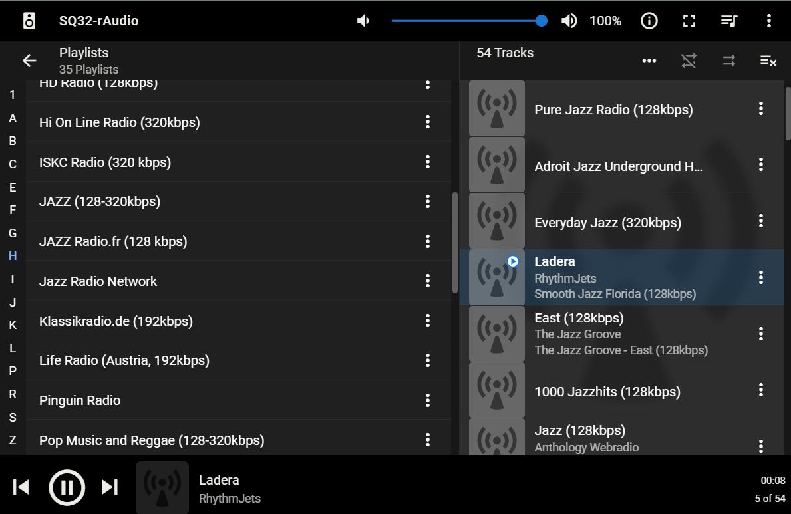

# Radios playlist
>
Here are 35 Radio Playlist files, with approximately 800 - 900 Music Radios.

You can add and listen to them using any program (phone, foobar2000, Pi, LMS...).

## Download link
[Download playlist_radio.tgz](https://raw.githubusercontent.com/lovehifi/playlist-radio/main/playlist_radio.tgz)
>

--------------------
## Download to your Pi
> wget https://raw.githubusercontent.com/lovehifi/playlist-radio/main/playlist_radio.tgz
> 
> tar -xzvf playlist_radio.tgz -C /mnt/
>
If using it for LMS, In the Server menu, go to Playlists Folder, choose the path to the playlist_radio folder. Save it to trigger a scan. Then go to My Music, Playlist, and choose what you'd like to listen to.
>

---------------------
>
## Radios list
### Radios playlist Klassikradio.de (192kbps)
	Radio: New Classics
		URL: http://stream.klassikradio.de/newclassics/mp3-192/www.klassikradio.de/
	Radio: Movie
		URL: http://stream.klassikradio.de/movie/mp3-192/www.klassikradio.de/
	Radio: Klassik Dreams
		URL: http://stream.klassikradio.de/dreams/mp3-192/www.klassikradio.de/
	Radio: Opera
		URL: http://stream.klassikradio.de/opera/mp3-192/www.klassikradio.de/
	Radio: Rock Meets Classic
		URL: http://stream.klassikradio.de/rockclassic/mp3-192/www.klassikradio.de/
	Radio: Brazil
		URL: http://stream.klassikradio.de/brazil/mp3-192/www.klassikradio.de/
	Radio: Smooth
		URL: http://stream.klassikradio.de/smooth/mp3-192/www.klassikradio.de/
	Radio: Klassik Rock
		URL: http://stream.klassikradio.de/klassikrock/mp3-192/www.klassikradio.de/
	Radio: Pure Verdi
		URL: http://stream.klassikradio.de/verdi/mp3-192/www.klassikradio.de/
	Radio: Lounge
		URL: http://stream.klassikradio.de/lounge/mp3-192/www.klassikradio.de/
	Radio: Klassik Radio Live
		URL: http://stream.klassikradio.de/live/mp3-192/www.klassikradio.de/
	Radio: Piano
		URL: http://stream.klassikradio.de/piano/mp3-192/www.klassikradio.de/
	Radio: Barock
		URL: http://stream.klassikradio.de/barock/mp3-192/www.klassikradio.de/
	Radio: Lounge Beat
		URL: http://stream.klassikradio.de/lounge-beat/mp3-192/www.klassikradio.de/
	Radio: Chor
		URL: http://stream.klassikradio.de/chor/mp3-192/www.klassikradio.de/
	Radio: Jean-Michel Jarre
		URL: http://stream.klassikradio.de/jmjarre/mp3-192/www.klassikradio.de/
	Radio: Friends @ Home
		URL: http://stream.klassikradio.de/friendshome/mp3-192/www.klassikradio.de/
	Radio: Christmas
		URL: http://stream.klassikradio.de/christmas/mp3-192/www.klassikradio.de/
	Radio: Pure Bach
		URL: http://stream.klassikradio.de/purebach/mp3-192/www.klassikradio.de/
	Radio: Pure Beethoven
		URL: http://stream.klassikradio.de/beethoven/mp3-192/www.klassikradio.de/
	Radio: Healing
		URL: http://stream.klassikradio.de/healing/mp3-192/www.klassikradio.de/
	Radio: Pure Mozart
		URL: http://stream.klassikradio.de/mozart/mp3-192/www.klassikradio.de/
	Radio: Games
		URL: http://stream.klassikradio.de/games/mp3-192/www.klassikradio.de/

### Radios playlist Русские станции (128-320kbps)
	Radio: Авторадио (256kbps)
		URL: http://ic7.101.ru:8000/s2
	Radio: Радио Лесная вода (128kbps)
		URL: http://s02.radio-tochka.com:4100/radio
	Radio: Мост радио (128kbps)
		URL: http://94.181.181.72:8000/;stream.mp3
	Radio: Радио Пляж (128kbps)
		URL: http://listen2.myradio24.com:9000/1632
	Radio: Экспресс Радио Орёл (128kbps)
		URL: http://159.253.18.97:8000/128kbit.mp3
	Radio: Ретро FM (256kbps)
		URL: http://retroserver.streamr.ru:8043/retro256.mp3
	Radio: Радио Рыжий Сентябрь (128kbps)
		URL: http://myradio24.org/45071
	Radio: Неформатное радио (128kbps)
		URL: http://www.neformatnoe.ru:8777/live
	Radio: Радио Метро (128kbps)
		URL: http://stream.radiometro.ru:8230/;
	Radio: radio2000x.com (320kbps)
		URL: http://air.radio2000x.com:8000/stream
	Radio: Шансон Без Цензуры (128kbps)
		URL: http://chanson.hostingradio.ru:8041/chanson-uncensored128.mp3
	Radio: Наше радио (256kbps)
		URL: http://nashe1.hostingradio.ru/nashe-256
	Radio: Радио Борнео Воронеж (128kbps)
		URL: http://live.borneo.ru:8888/128
	Radio: Неслучайное радио (128kbps)
		URL: http://aska.ru-hoster.com:8006/stream
	Radio: Радио Скиф (256kbps)
		URL: http://178.172.150.248:2530/;
	Radio: Радио 7 на семи холмах (256kbps)
		URL: https://radio7.hostingradio.ru:8040/radio7256.mp3
	Radio: Рок-атака (128kbps)
		URL: http://myradio24.org/rockataka
	Radio: Мото радио (AAC 256kbps)
		URL: http://stream.motoradio.online:8000/high-aac
	Radio: Радио Континенталь Челябинск (128kbps)
		URL: http://stream01.radiocon.ru:8000/live
	Radio: Наше радио 2.0 (128kbps)
		URL: http://nashe.streamr.ru/nashe20-128.mp3
	Radio: Дорожное радио Москва (320kbps)
		URL: http://emgregion.hostingradio.ru:8064/moscow.dorognoe.mp3
	Radio: Радио Мята (128kbps)
		URL: http://radio.dline-media.com/myata
	Radio: Радиола (128kbps)
		URL: http://online1.gkvr.ru:8000/radiola_eka_128.mp3
	Radio: Радио Лемма Владивосток (128kbps)
		URL: http://212.107.192.130:8000/;
	Radio: Радио Вечная молодость (128kbps)
		URL: http://misato.ru-hoster.com:8037/stream
	Radio: Радио Матрешка (192kbps)
		URL: http://213.159.214.57:8000/matryoshka
	Radio: Радио Ваня (96kbps)
		URL: http://icecast-radiovanya.cdnvideo.ru/radiovanya
	Radio: Русское радио Москва (128kbps)
		URL: http://dfm.hostingradio.ru/rusradio128.mp3
	Radio: Радио 54 (192kbps)
		URL: http://91.202.68.50:8000/;stream.mp3
	Radio: Шансон Романтика (256kbps)
		URL: http://chanson.hostingradio.ru:8041/chanson-romantic256.mp3
	Radio: Дорожное Радио (320kbps)
		URL: http://dorognoe.hostingradio.ru:8000/radio
	Radio: Радио ОлдХит (320kbps)
		URL: http://radio.oldxit.ru:8030/radio
	Radio: Страна FM (256kbps)
		URL: http://icecast.stranafm.cdnvideo.ru/stranafm_256
	Radio: Радио СИ, Екатеринбург (128kbps)
		URL: http://188.254.50.254:8000/radioc256
	Radio: Хиты России - Рига (128kbps)
		URL: http://stream.superfm.lv:8000/khr.mp3
	Radio: Ретро FM 80-е (128kbps)
		URL: http://europaplus.hostingradio.ru:8014/retro80-128.mp3
	Radio: Шансон (256kbps)
		URL: http://chanson.hostingradio.ru:8041/chanson256.mp3
	Radio: Спутник FM  Волгоград (128kbps)
		URL: http://online.sputnikfm.ru:8000/sputnik_mp3
	Radio: Donat FM - Russian Rock (128kbps)
		URL: http://c6.radioboss.fm:8097/autodj
	Radio: Дорожное радио Танцы по-Русски (128kbps)
		URL: http://dorognoe.hostingradio.ru:8000/dorognoe1945.mp3
	Radio: Радио Серебряный дождь (128kbps)
		URL: http://213.59.4.27:8000/silver128.mp3
	Radio: BIM-radio (256kbps)
		URL: http://av.bimradio.ru:8066/bim_mp3
	Radio: Старое радио (128kbps)
		URL: http://195.91.237.50:8000/music128
	Radio: Радио Добрый настрой (128kbps)
		URL: http://s3.radioheart.ru:8013/nonstop
	Radio: Радио Голос Ангары (256kbps)
		URL: http://91.189.162.134:8006/;stream.nsv
	Radio: Рок Арсенал (128kbps)
		URL: http://online.rockarsenal.ru:8000/rockarsenal
	Radio: Радио День (192kbps)
		URL: http://air.radioday.fm/mp3
	Radio: Радио Мелодия (128kbps)
		URL: http://stream128.melodiafm.spb.ru:8000/melodia128
	Radio: Радио Олимп (128kbps)
		URL: http://188.128.117.99:8000/olimp_mp3
	Radio: Наше радио Punks (128kbps)
		URL: http://jfm1.hostingradio.ru:14536/nashepunks.mp3
	Radio: Радио Калина Красная (160kbps)
		URL: http://icecast-studio21.cdnvideo.ru/KalynaK_1a
	Radio: Радио Странствий (192kbps)
		URL: http://myradio24.org/4156
	Radio: Наше радио Songs (128kbps)
		URL: http://jfm1.hostingradio.ru:14536/nashesongs.mp3
	Radio: Радио родных дорог (128kbps)
		URL: http://stream1.radiord.ru:8000/live96.mp3
	Radio: Радио Ваня Олдскул (128kbps)
		URL: http://icecast-radiovanya.cdnvideo.ru:8000/rv_retro
	Radio: Радио Подсолнух (128kbps)
		URL: https://live.podsolnuh.media:8000/radio
	Radio: Радио Искатель (128kbps)
		URL: http://iskatel.hostingradio.ru:8015/iskatel-128.mp3
	Radio: Радио Сова (192kbps)
		URL: http://radiosova.ru:8000/radio
	Radio: Радио КОНТУР (256kbps)
		URL: http://misato.ru-hoster.com:8029/stream
	Radio: Радио Гамаюн (256kbps)
		URL: http://gamaun.online:8020/radio
	Radio: Радио Юность (192kbps)
		URL: http://icecast.vgtrk.cdnvideo.ru/unost_mp3_192kbps
	Radio: ЯсенБит (192kbps)
		URL: http://radio.yasenbit.net:8000/yasenbit192k
	Radio: Радио Движение (192kbps)
		URL: http://c4.radioboss.fm:8218/stream
	Radio: Русское радио в Германии (128kbps)
		URL: http://play.russianradio.eu/
	Radio: Радио Русь (128kbps)
		URL: http://radio-holding.ru:9000/rus
	Radio: Радио Ваня Веселый Dance (128kbps)
		URL: http://icecast-radiovanya.cdnvideo.ru:8000/rv_Happy_Dance
	Radio: Радио Дача (96kbps)
		URL: http://listen.vdfm.ru:8000/dacha
	Radio: Радио Город FM Екатеринбург (256kbps)
		URL: http://radio.gorodfm.ru:8000/gorodfm
	Radio: Радио 107.8 (256kbps)
		URL: http://radio.mvd.ru:8000/mv128.mp3
	Radio: Бард Радио (128kbps)
		URL: http://a7.radioheart.ru:8010/RH4465
	Radio: Русские песни (160kbps)
		URL: http://listen.rusongs.ru/ru-hd
	Radio: Радио Два берега (256kbps)
		URL: http://2beregafm.ru:8100/ber_FM.ogg
	Radio: Питер FM (160kbps)
		URL: http://icecast-piterfm.cdnvideo.ru/piterfm
	Radio: Радио Сигма Новый Уренгой (256kbps)
		URL: http://195.191.130.125:8000/sigma
	Radio: Пи FM Москва (128kbps)
		URL: https://cdn.pifm.ru/mp3
	Radio: Ретро FM 70-е (128kbps)
		URL: http://europaplus.hostingradio.ru:8014/retro70-128.mp3
	Radio: Первое портальное радио (192kbps)
		URL: http://myradio24.org/2200
	Radio: Радио Весна FM Смоленск (128kbps)
		URL: http://91.203.176.214:8000/vesnafm?
	Radio: Радио Твоя волна (256kbps)
		URL: http://icecast-tvoyavolna.cdnvideo.ru/tvoyavolna
	Radio: Советская эстрада (256kbps)
		URL: http://evcast.mediacp.eu:2070/stream
	Radio: Orgasma Sloboda (224kbps)
		URL: http://listen2.orgasma.fm/sloboda

### Radios playlist Rock and Blues (128-320kbps)
	Radio: MPM radio (192kbps)
		URL: http://s01.diazol.hu:10060/live
	Radio: ROCK RADIO SI (128kbps)
		URL: http://stream.rockradio.si:9034/stream/;
	Radio: The Blues Cove (192kbps)
		URL: http://radio.streemlion.com:2070/stream
	Radio: La Grosse Radio Reggae (192kbps)
		URL: http://hd.lagrosseradio.info:8000/lagrosseradio-reggae-192.mp3
	Radio: The Colorful Radio (192kbps)
		URL: http://www.radiart.eu:8244/stream
	Radio: Classic Rock Planet HD (128kbps)
		URL: http://144.217.158.59:5098/stream
	Radio: Alternative Broadcast Technology (256kbps)
		URL: http://xymox.dyndns.org:5000/shout
	Radio: ROQ FM (128kbps)
		URL: http://thassos.cdnstream.com:5143/stream.mp3
	Radio: KINK DNA Classics (192kbps)
		URL: https://playerservices.streamtheworld.com/api/livestream-redirect/KINK_DNA.mp3
	Radio: Eldoradio 80s (256kbps)
		URL: http://sc-eldo80s.newmedia.lu:80/
	Radio: Death.FM (128kbps)
		URL: http://hi5.death.fm/;stream.mp3
	Radio: Radio Ostrock (192kbps)
		URL: http://secondradio.de:7070/ostrock
	Radio: Morow Prog Rock Radio (128kbps AAC+)
		URL: http://stream.fr.morow.com:8080/morow_hi.aacp
	Radio: LaRockaforte (192kbps)
		URL: http://stream.radiomusic.net:8120/;
	Radio: Blues Radio (192kbps)
		URL: http://live.bluesradio.gr:8352/stream
	Radio: Hard Rock Station (192kbps)
		URL: http://listen.radioking.com/radio/86347/stream/125572
	Radio: Sonora Classic Rock (Hard & Metal) (192kbps)
		URL: http://46.105.122.141:6664/;
	Radio: Beatles Radio (128kbps)
		URL: http://www.beatlesradio.com:8000/stream/1/;
	Radio: Monsters of Rock (128kbps)
		URL: http://ice55.securenetsystems.net/DASH14
	Radio: VOLOSATOE RADIO (256kbps)
		URL: http://volosatoff.ru:8008/rnm
	Radio: Arrow Classic Rock (192kbps)
		URL: http://stream.gal.io/arrow
	Radio: Radio Kiss Kiss Rock (128kbps AAC)
		URL: http://ice08.fluidstream.net/kk_rock.aac
	Radio: HearMe - Contemporary Blues (128kbps)
		URL: http://hearme.fm:8643/stream
	Radio: BluesMen Channel - Gold (320kbps)
		URL: http://173.249.21.17:8114/;
	Radio: Eldoradio Alternative (256kbps)
		URL: http://sc-eldoalt.newmedia.lu:80/
	Radio: BeRock Radio (192kbps)
		URL: http://solid55.streamupsolutions.com:30013/stream
	Radio: FFH Rock (128kbps)
		URL: http://mp3.ffh.de/ffhchannels/hqrock.mp3
	Radio: Bluesway Online Radio (320kbps)
		URL: http://everest.streams.ovh:1280/stream
	Radio: TurboDJ Rock Radio (128kbps)
		URL: http://rock.turbodj.com/;
	Radio: United FM Radio Rock Metal (192kbps)
		URL: http://167.114.18.120:8050/stream/1/
	Radio: 7radio (192kbps)
		URL: http://91.121.38.100:8190/;
	Radio: BluesMen Channel - Hits (320kbps)
		URL: http://173.249.21.17:8108/;
	Radio: Rock Chicks Radio (192kbps)
		URL: http://178.33.33.176:8060/;
	Radio: GlassRock (160kbps)
		URL: http://glassrock.live-streams.nl:8007/live?type=.mp3
	Radio: Bar Legend Radio (320kbps)
		URL: http://solid24.streamupsolutions.com:8010/stream
	Radio: GenXRock (128kbps)
		URL: http://s10.citrus3.com:8124/stream
	Radio: La Grosse Radio Rock Alternative (192kbps)
		URL: http://hd.lagrosseradio.info:8000/lagrosseradio-rock-192.mp3
	Radio: Ad Infinitum (128kbps)
		URL: http://stream.laut.fm/ad_infinitum
	Radio: Space Coast Metal - Mannard Metal Radio (256kbps)
		URL: http://72.239.233.53:6969/high.mp3
	Radio: Blackwood FM (192kbps)
		URL: http://server-24.stream-server.nl:8326/stream
	Radio: Delicious Agony Progressive Rock Radio (128kbps)
		URL: http://deliciousagony.streamguys1.com
	Radio: ultima.fm (128kbps)
		URL: http://sc.ultima.fm:8001/stream/1/stream.mp3/;
	Radio: La Grosse Radio Metal (192kbps)
		URL: http://hd.lagrosseradio.info:8000/lagrosseradio-metal-192.mp3
	Radio: Anthology Webradio - Blues (128kbps)
		URL: http://listen.shoutcast.com/a-ablues
	Radio: Retro80sRadio (128kbps)
		URL: http://158.69.227.214:8113/stream
	Radio: 95.2 Rock FM ru (256kbps)
		URL: http://nashe1.hostingradio.ru:80/rock-256
	Radio: KINK DISTORTION (192kbps)
		URL: https://playerservices.streamtheworld.com/api/livestream-redirect/KINK_DISTORTION.mp3
	Radio: Radio Bloodstream (128kbps)
		URL: http://uk1.internet-radio.com:8294/live
	Radio: Metal Express Radio (192kbps)
		URL: http://5.135.154.69:11590/;
	Radio: Nice Tunes Radio (256kbps)
		URL: http://eu10.fastcast4u.com:5120/stream
	Radio: KINK No Alternative (192kbps)
		URL: http://playerservices.streamtheworld.com/api/livestream-redirect/KINK.mp3
	Radio: CDNX London Market (256kbps)
		URL: http://msmn7.co:8018/stream

### Radios playlist Radio Jazz FM (128kbps)
	Radio: JAZZ Legends
		URL: http://jazz128legends.streamr.ru
	Radio: JAZZ Vocals
		URL: http://jazz128vocals.streamr.ru
	Radio: Instrumental JAZZ
		URL: http://jazz128instr.streamr.ru
	Radio: Smooth JAZZ
		URL: http://jazz128smooth.streamr.ru
	Radio: Radio JAZZ
		URL: https://nashe1.hostingradio.ru:18000/jazz-128.mp3

### Radios playlist Hi On Line Radio (320kbps)
	Radio: Gold
		URL: http://mediaserv30.live-streams.nl:8000/live
	Radio: World
		URL: http://mediaserv38.live-streams.nl:8027/live
	Radio: Lounge
		URL: http://mediaserv33.live-streams.nl:8036/live
	Radio: Pop
		URL: http://mediaserv30.live-streams.nl:8086/live
	Radio: Latin
		URL: http://mediaserv33.live-streams.nl:8034/live
	Radio: Jazz
		URL: http://mediaserv38.live-streams.nl:8006/live
	Radio: France
		URL: http://mediaserv21.live-streams.nl:8000/live
	Radio: Classical
		URL: http://mediaserv30.live-streams.nl:8088/live

### Radios playlist HD Music (320kbps)
	Radio: Pure Classix
		URL: http://server5.radio-streams.net:8001/live
	Radio: Gora - Electro Gora Electro
		URL: http://listen.radiogora.ru:8000/electro320
	Radio: 2x2 Радио Ульяновск (499kbps, ogg)
		URL: http://95.104.192.220:8001/radio2x2.ogg
	Radio: The Ranch
		URL: http://puma.streemlion.com:3200/stream
	Radio: SUN
		URL: http://diffusion.lafrap.fr:8000/sun.aac
	Radio: Ally-Radio
		URL: http://everestcast.streams.ovh:2300/stream
	Radio: The Double-O Stream
		URL: http://listen.noagendastream.com:80/oo
	Radio: Lucky Radio
		URL: http://cmr-hosting.com:8470/;stream.mp3
	Radio: studio1radio
		URL: http://i9.streams.ovh:19102/autodj
	Radio: Cambrian Radio
		URL: http://everestcast.shoutcastservices.com:1590/stream
	Radio: Linn radio
		URL: http://radio.linn.co.uk:8003/autodj
	Radio: Radio Catherine International
		URL: http://104.167.4.67:8134/autodj
	Radio: Classic Vinyl HD
		URL: https://icecast.walmradio.com:8443/classic
	Radio: ONAIR66 - CANAL 03
		URL: http://manager6.streamradio.fr:1660/stream
	Radio: FUNKY RADIO
		URL: http://funkyradio.streamingmedia.it:8001/play.mp3
	Radio: DB9009-TX
		URL: http://2240.cloudrad.io:8120/live
	Radio: MondoBongo
		URL: http://5.63.151.52:7082/;stream/1.mp3
	Radio: Радио Культура
		URL: http://icecast.vgtrk.cdnvideo.ru/kulturafm
	Radio: Chaos Radio
		URL: http://5.135.177.61:8000/;stream/1
	Radio: WEBFM
		URL: http://netradio.webfm.dk/Webfm
	Radio: All Oldies Radio
		URL: http://kastos.cdnstream.com/1345_320
	Radio: HotrodRadio
		URL: http://everestcast.live-streams.nl:8181/stream
	Radio: RadioZapliN
		URL: http://www.radiozaplin.com:8000/;
	Radio: Teams Radio
		URL: http://i8.streams.ovh:18146/autodj
	Radio: Radio Eco Vicentino - Soul
		URL: http://c30.radioboss.fm:8137/autodj
	Radio: IP Music
		URL: http://live7.avf.ch:8000/ipmusic320
	Radio: Astrocafe Radio
		URL: http://de1.internet-radio.com:8162/live
	Radio: Web Radio Tzitzifiogos
		URL: http://i.streams.ovh:9555/live_autodj
	Radio: USA Dance Radio
		URL: http://s7.streammonster.com:8260/;
	Radio: 70-80 Hits HQ
		URL: http://nr8.newradio.it:9574/autodj
	Radio: ONAIR66 - CANAL 04
		URL: http://manager6.streamradio.fr:1910/stream
	Radio: ONAIR66 - CANAL 01
		URL: http://manager8.streamradio.fr:1570/stream
	Radio: Gora - Et Cetera
		URL: http://listen.radiogora.ru:8000/etc320
	Radio: TOP 80
		URL: http://109.71.41.6:8086/stream
	Radio: Радио Zaplin
		URL: http://radiozaplin.com:8000/;
	Radio: Linn Jazz
		URL: http://radio.linn.co.uk:8000/autodj
	Radio: ONAIR66 - CANAL 02
		URL: http://manager8.streamradio.fr:1200/stream
	Radio: Free Fm UK
		URL: http://radio.freefm.uk:8020/radio.ogg
	Radio: Classixx
		URL: http://www.clubfmserver.be:8000/classixxdab.mp3
	Radio: Agaune Radio
		URL: http://ecmanager3.pro-fhi.net:2640/stream
	Radio: Pistache
		URL: http://rpstrm.pistache.org:8443/pistache.aac
	Radio: Love Online
		URL: http://c18.radioboss.fm:8029/autodj
	Radio: Rock Melodic Radio AOR
		URL: http://live.rockmelodic-radio.com:8124/;
	Radio: Round and Sound radio
		URL: http://stream.roundandsound.nl:80/;
	Radio: Radio Paradise
		URL: http://stream-dc1.radioparadise.com:80/aac-320
	Radio: Double XX
		URL: http://manager.conceptradio.fr:2120/stream
	Radio: Euphoric Trip Radio
		URL: http://cheetah.streemlion.com:4780/stream
	Radio: Milky Way Radio (512kbps AAC)
		URL: http://milky-way.network/512kbps.m4a
	Radio: Radio ETC
		URL: http://srv2.listen.radiogora.ru:8800/etc320
	Radio: i-turn Radio
		URL: http://live.i-turnradio.nl:80/320
	Radio: Wans
		URL: http://hemnos.cdnstream.com/1442_128?NoPreroll=true
	Radio: RadiostART
		URL: http://radio.dyne.org:80/liveradiostart
	Radio: Kirtang Pirate Radio
		URL: http://server.kirtangpirateradio.com:1050/stream
	Radio: HotWaxRadio.com
		URL: http://stream.abyss-shoutcast.com:5236/stream
	Radio: UP RADIO
		URL: http://upradio.ovh:8054/up-high
	Radio: Linn Classical
		URL: http://radio.linn.co.uk:8004/autodj

### Radios playlist RADIO BOB (192kbps)
	Radio: Singer & Songwriter
		URL: http://streams.radiobob.de/bob-singersong/mp3-192/streams.radiobob.de/
	Radio: Wacken Nonstop
		URL: http://streams.radiobob.de/bob-wacken/mp3-192/streams.radiobob.de/
	Radio: Classic Rock
		URL: http://streams.radiobob.de/bob-classicrock/mp3-192/streams.radiobob.de/
	Radio: Metal
		URL: http://streams.radiobob.de/bob-metal/mp3-192/streams.radiobob.de/
	Radio: rockt Schleswig-Holstein
		URL: http://streams.radiobob.de/bob-shlive/mp3-192/streams.radiobob.de/
	Radio: Eisenworkout
		URL: http://streams.radiobob.de/bob-ironworkout/mp3-192/streams.radiobob.de/
	Radio: Rock Hits
		URL: http://streams.radiobob.de/bob-rockhits/mp3-192/streams.radiobob.de/
	Radio: Live
		URL: http://streams.radiobob.de/bob-livemusic/mp3-192/streams.radiobob.de/
	Radio: ACDC Collection
		URL: http://streams.radiobob.de/bob-acdc/mp3-192/streams.radiobob.de/
	Radio: Blues
		URL: http://streams.radiobob.de/bob-blues/mp3-192/streams.radiobob.de/
	Radio: Harte Saite
		URL: http://streams.radiobob.de/bob-hartesaite/mp3-192/streams.radiobob.de/
	Radio: Punk
		URL: http://streams.radiobob.de/bob-punk/mp3-192/streams.radiobob.de/
	Radio: Queen-Stream
		URL: http://streams.radiobob.de/bob-queen/mp3-192/streams.radiobob.de/
	Radio: Alternative Rock
		URL: http://streams.radiobob.de/bob-alternative/mp3-192/streams.radiobob.de/
	Radio: Grunge
		URL: http://streams.radiobob.de/bob-grunge/mp3-192/streams.radiobob.de/
	Radio: Kuschelrock
		URL: http://streams.radiobob.de/bob-kuschelrock/mp3-192/streams.radiobob.de/
	Radio: Deutsch Rock
		URL: http://streams.radiobob.de/bob-deutsch/mp3-192/streams.radiobob.de/
	Radio: 90er Rock
		URL: http://streams.radiobob.de/bob-90srock/mp3-192/streams.radiobob.de/
	Radio: Christmas Rock
		URL: http://streams.radiobob.de/bob-christmas/mp3-192/streams.radiobob.de/
	Radio: 80er Rock
		URL: http://streams.radiobob.de/bob-80srock/mp3-192/streams.radiobob.de/
	Radio: Best of Rock
		URL: http://streams.radiobob.de/bob-bestofrock/mp3-192/streams.radiobob.de/
	Radio: Radio BOB!
		URL: http://streams.radiobob.de/bob-live/mp3-192/streams.radiobob.de/

### Radios playlist JAZZ Radio.fr (128 kbps)
	Radio: Happy Hour
		URL: http://jazz-wr14.ice.infomaniak.ch/jazz-wr14-128.mp3
	Radio: Classic Jazz
		URL: http://jazz-wr01.ice.infomaniak.ch/jazz-wr01-128.mp3
	Radio: Reprises
		URL: http://reprises.ice.infomaniak.ch/reprises-high.mp3
	Radio: Contemporary Jazz
		URL: http://jazz-wr05.ice.infomaniak.ch/jazz-wr05-128.mp3
	Radio: Soul Food by DJ Philgood
		URL: http://jazz-wr12.ice.infomaniak.ch/jazz-wr12-128.mp3
	Radio: Jazz & Cinema
		URL: http://jzr-wr20.ice.infomaniak.ch/jzr-wr20.mp3
	Radio: Stax and Motown
		URL: http://jazz-wr15.ice.infomaniak.ch/jazz-wr15-128.mp3
	Radio: Lounge
		URL: http://jazzlounge.ice.infomaniak.ch/jazzlounge-high.mp3
	Radio: Blues
		URL: http://jazzblues.ice.infomaniak.ch/jazzblues-high.mp3
	Radio: Jazz Manouche
		URL: http://jazz-wr02.ice.infomaniak.ch/jazz-wr02-128.mp3
	Radio: Gospel
		URL: http://jazz-wr07.ice.infomaniak.ch/jazz-wr07-128.mp3
	Radio: Groov'Up
		URL: http://jazz-wr13.ice.infomaniak.ch/jazz-wr13-128.mp3
	Radio: Jazz Fusion
		URL: http://jazz-radio-fusion.ice.infomaniak.ch/jazz-radio-fusion.mp3
	Radio: Soul
		URL: http://jazz-wr10.ice.infomaniak.ch/jazz-wr10-128.mp3
	Radio: Nouveautés Soul
		URL: http://jzr-wr19.ice.infomaniak.ch/jzr-wr19-128.mp3
	Radio: Jazzy French
		URL: http://jazz-wr18.ice.infomaniak.ch/jazz-wr18-128.mp3
	Radio: Groove
		URL: http://jazz-wr08.ice.infomaniak.ch/jazz-wr08-128.mp3
	Radio: Saxo Jazz
		URL: http://jzr-saxo.ice.infomaniak.ch/jzr-saxo.mp3
	Radio: Funk
		URL: http://jazz-wr06.ice.infomaniak.ch/jazz-wr06-128.mp3
	Radio: Ladies & Crooners
		URL: http://jazzladiescrooners.ice.infomaniak.ch/jazzladiescrooners-high.mp3
	Radio: Electro Swing
		URL: http://jazz-wr04.ice.infomaniak.ch/jazz-wr04-128.mp3
	Radio: Sly Johnson radio
		URL: http://jazz-thema.ice.infomaniak.ch/jazz-thema.mp3
	Radio: Latin Jazz
		URL: http://jazz-wr09.ice.infomaniak.ch/jazz-wr09-128.mp3
	Radio: Zen Attitude
		URL: http://zen-attitude.ice.infomaniak.ch/zen-attitude.mp3
	Radio: Christmas Jazz
		URL: http://jazz-wr16.ice.infomaniak.ch/jazz-wr16-128.mp3
	Radio: Sunset
		URL: http://jzr-sunset.ice.infomaniak.ch/jzr-sunset.mp3
	Radio: New Orleans
		URL: http://jazz-wr03.ice.infomaniak.ch/jazz-wr03-128.mp3
	Radio: Black Music
		URL: http://jazzblackmusic.ice.infomaniak.ch/jazzblackmusic-high.mp3
	Radio: Nouveautés Jazz
		URL: http://jzr-wr99.ice.infomaniak.ch/jzr-wr99.mp3
	Radio: Jazz Radio
		URL: http://jazzradio.ice.infomaniak.ch/jazzradio-high.mp3
	Radio: Piano Jazz
		URL: http://jzr-piano.ice.infomaniak.ch/jzr-piano.mp3
	Radio: Jazz & Classique
		URL: http://jazz-wr17.ice.infomaniak.ch/jazz-wr17-128.mp3
	Radio: Valentine's Day
		URL: http://jzr-events-01.ice.infomaniak.ch/jzr-events-01.mp3

### Radios playlist Pinguin Radio
	Radio: Fiësta (128kbps)
		URL: https://19293.live.streamtheworld.com/SP_R2292843_SC
	Radio: On the Rocks (192kbps)
		URL: http://streams.pinguinradio.com/PinguinOnTheRocks192.mp3
	Radio: Showcase (192kpbs)
		URL: https://samcloud.spacial.com/api/listen?sid=110690&m=sc&rid=190799
	Radio: Pluche (192kbps)
		URL: https://samcloud.spacial.com/api/listen?sid=98569&m=sc&rid=174384
	Radio: Blues (192kbps)
		URL: https://18123.live.streamtheworld.com/SP_R2406394_SC
	Radio: Indie (320kbps)
		URL: http://streams.pinguinradio.com/PinguinRadio320.mp3
	Radio: World (192kbps)
		URL: https://samcloud.spacial.com/api/listen?sid=98570&m=sc&rid=174387
	Radio: Classics (192kbps)
		URL: http://streams.pinguinradio.com/PinguinClassics192.mp3
	Radio: Pop (192kbps)
		URL: https://samcloud.spacial.com/api/listen?sid=98586&m=sc&rid=174409
	Radio: Aardschok Radio (192kbps)
		URL: http://streams.pinguinradio.com/Aardschok192.mp3
	Radio: Grooves (192kbps)
		URL: https://samcloud.spacial.com/api/listen?sid=98587&m=sc&rid=174412

### Radios playlist Radio Clasic România (AAC)
	Radio: Radio Clasic Latino
		URL: http://www.clasicradio.ro:8600/stream
	Radio: Radio Clasic România
		URL: http://www.clasicradio.ro:8000/streamHD
	Radio: Radio Clasic Chopin
		URL: http://www.clasicradio.ro:8024/stream
	Radio: Radio Clasic Soundtrack
		URL: http://www.clasicradio.ro:7400/stream
	Radio: Red Radio
		URL: http://www.clasicradio.ro:7900/stream
	Radio: Radio Clasic Country
		URL: http://www.clasicradio.ro:7012/stream
	Radio: Radio Clasic Jazz
		URL: http://www.clasicradio.ro:7800/stream
	Radio: Summer Hits
		URL: http://www.clasicradio.ro:8008/stream
	Radio: ZeZe Radio
		URL: http://www.clasicradio.ro:7030/stream
	Radio: Radio Clasic Love
		URL: http://www.clasicradio.ro:8500/stream
	Radio: AltRock
		URL: http://www.clasicradio.ro:8032/stream
	Radio: Radio Clasic Christmas
		URL: http://www.clasicradio.ro:8900/stream
	Radio: Radio Clasic Opera
		URL: http://www.clasicradio.ro:7500/stream
	Radio: Radio Clasic Bach
		URL: http://www.clasicradio.ro:9100/stream
	Radio: Radio Clasic Beethoven
		URL: http://www.clasicradio.ro:7200/stream
	Radio: Radio Clasic Vivaldi
		URL: http://www.clasicradio.ro:8800/stream
	Radio: Radio Clasic Tchaikovscky
		URL: http://www.clasicradio.ro:7300/stream
	Radio: Radio Clasic Kids
		URL: http://www.clasicradio.ro:7600/stream
	Radio: Radio Clasic Popular
		URL: http://www.clasicradio.ro:7700/stream
	Radio: Radio Clasic R’n’B
		URL: http://www.clasicradio.ro:7018/stream
	Radio: Radio Clasic Hits
		URL: http://www.clasicradio.ro:7000/stream
	Radio: BlueJazz Radio
		URL: http://www.clasicradio.ro:8400/stream
	Radio: Radio Clasic Folk
		URL: http://www.clasicradio.ro:8016/stream
	Radio: Radio Clasic Relax
		URL: http://www.clasicradio.ro:8700/stream
	Radio: Radio Clasic Rock
		URL: http://www.clasicradio.ro:7100/stream
	Radio: Radio Clasic Blues
		URL: http://www.clasicradio.ro:7036/stream
	Radio: Radio Clasic Plus
		URL: http://www.clasicradio.ro:7006/stream
	Radio: Radio Clasic Strauss
		URL: http://www.clasicradio.ro:8100/stream
	Radio: Radio Clasic Mozart
		URL: http://www.clasicradio.ro:8300/stream
	Radio: Radio Clasic 100% Românesc
		URL: http://www.clasicradio.ro:8204/stream

### Radios playlist Радио Орфей
	Radio: Русская хоровая (256kbps)
		URL: https://channels.fonotron.ru:8000/Chan_64_256.mp3
	Radio: Музыка мюзиклов (256kbps)
		URL: https://channels.fonotron.ru:8000/Chan_66_256.mp3
	Radio: Камерата (256kbps)
		URL: https://channels.fonotron.ru:8000/Chan_76_256.mp3
	Radio: Фолк-музыка (256kbps)
		URL: https://channels.fonotron.ru:8000/Chan_63_256.mp3
	Radio: Радио Орфей (192kbps)
		URL: https://orfeyfm.hostingradio.ru:8034/orfeyfm192.mp3
	Radio: Русская классика (256kbps)
		URL: https://channels.fonotron.ru:8000/Chan_73_256.mp3
	Radio: Популярная классика (256kbps)
		URL: https://channels.fonotron.ru:8000/Chan_72_256.mp3
	Radio: Клавир (256kbps)
		URL: https://channels.fonotron.ru:8000/Chan_77_256.mp3
	Radio: Симфоническая музыка (256kbps)
		URL: https://channels.fonotron.ru:8000/Chan_74_256.mp3
	Radio: Хоры из опер (256kbps)
		URL: https://channels.fonotron.ru:8000/Chan_62_256.mp3
	Radio: Классика крупных форм (192kbps)
		URL: https://channels.fonotron.ru:8000/Chan_8_192.mp3
	Radio: Классика без границ (192kbps)
		URL: https://orfeyfm.hostingradio.ru:8034/orpheuscwb192.mp3
	Radio: Классика эстрады (256kbps)
		URL: https://channels.fonotron.ru:8000/Chan_7_192.mp3
	Radio: Классика киномузыки (256kbps)
		URL: https://channels.fonotron.ru:8000/Chan_9_192.mp3
	Radio: Классика музыкального кроссовера (256kbps)
		URL: https://channels.fonotron.ru:8000/Chan_6_192.mp3
	Radio: Зарубежная хоровая (256kbps)
		URL: https://channels.fonotron.ru:8000/Chan_60_256.mp3
	Radio: Классика джаза (192kbps)
		URL: https://channels.fonotron.ru:8000/Chan_12_192.mp3
	Radio: Современная хоровая (256kbps)
		URL: https://channels.fonotron.ru:8000/Chan_61_256.mp3
	Radio: Музыка с участием духовых (256kbps)
		URL: https://channels.fonotron.ru:8000/Chan_65_256.mp3
	Radio: Бельканто (256kbps)
		URL: https://channels.fonotron.ru:8000/Chan_75_256.mp3

### Radios playlist Life Radio (Austria, 192kbps)
	Radio: Sommersongs
		URL: https://stream.liferadio.at/sommer/mp3-192/app/
	Radio: Austrian Rock Radio
		URL: http://live.antenne.at/arr
	Radio: Classic Rock
		URL: https://stream.liferadio.at/clrock/mp3-192/app/
	Radio: 90er
		URL: https://stream.liferadio.at/90er/mp3-192/app/
	Radio: Power Songs
		URL: https://stream.liferadio.at/powersongs/mp3-192/app/
	Radio: Testchannel
		URL: https://liferadio.stream.vip/test/mp3-192/app/
	Radio: Life Radio
		URL: https://stream.liferadio.at/liferadio/mp3-192/app/
	Radio: Chill Out
		URL: https://stream.liferadio.at/chillout/mp3-192/app/
	Radio: 80er
		URL: https://stream.liferadio.at/80er/mp3-192/app/
	Radio: Top500
		URL: https://stream.liferadio.at/top500/mp3-192/app/
	Radio: Home Office
		URL: https://stream.liferadio.at/homeoffice/mp3-192/app/
	Radio: Christmas
		URL: https://stream.liferadio.at/xmas/mp3-192/app/

### Radios playlist EKR Digital Radio (320kbps)
	Radio: Now Zone
		URL: http://ekrrockradio5.scs.ms:8500/;
	Radio: Retro Rock
		URL: http://ekrrockradio4.scs.ms:8400/;
	Radio: European Klassik Rock
		URL: http://ekrrockradio1.scs.ms:8100/;
	Radio: Rock Paradise
		URL: http://ekrrockradio2.scs.ms:8200/;
	Radio: Oldies Paradise
		URL: http://ekrrockradio3.scs.ms:8300/;

### Radios playlist Зайцев.FM (256kbps)
	Radio: Folk Rock
		URL: http://zaycevfm.cdnvideo.ru/ZaycevFM_folk_256.mp3
	Radio: Electronic
		URL: http://zaycevfm.cdnvideo.ru/ZaycevFM_electronic_256.mp3
	Radio: Metal
		URL: http://zaycevfm.cdnvideo.ru/ZaycevFM_metal_256.mp3
	Radio: Зайчата
		URL: http://zaycevfm.cdnvideo.ru/ZaycevFM_zaychata_256.mp3
	Radio: Club
		URL: http://zaycevfm.cdnvideo.ru/ZaycevFM_electronic_256.mp3
	Radio: Bass
		URL: http://zaycevfm.cdnvideo.ru/ZaycevFM_bass_256.mp3
	Radio: Ру Рок
		URL: http://zaycevfm.cdnvideo.ru/ZaycevFM_rurock_256.mp3
	Radio: Classic
		URL: http://zaycevfm.cdnvideo.ru/ZaycevFM_classic_256.mp3
	Radio: Шансон
		URL: http://zaycevfm.cdnvideo.ru/ZaycevFM_shanson_256.mp3
	Radio: K-Pop
		URL: http://zaycevfm.cdnvideo.ru/ZaycevFM_kpop_256.mp3
	Radio: Pop
		URL: http://zaycevfm.cdnvideo.ru/ZaycevFM_pop_256.mp3
	Radio: Love
		URL: http://zaycevfm.cdnvideo.ru/ZaycevFM_holiday_256.mp3
	Radio: Rap
		URL: http://zaycevfm.cdnvideo.ru/ZaycevFM_rap_256.mp3
	Radio: Новый год
		URL: http://zaycevfm.cdnvideo.ru/ZaycevFM_newyear_256.mp3
	Radio: Disco
		URL: http://zaycevfm.cdnvideo.ru/ZaycevFM_disco_256.mp3
	Radio: New Rock
		URL: http://zaycevfm.cdnvideo.ru/ZaycevFM_alternative_256.mp3
	Radio: Rus
		URL: http://zaycevfm.cdnvideo.ru/ZaycevFM_rus_256.mp3
	Radio: Relax
		URL: http://zaycevfm.cdnvideo.ru/ZaycevFM_relax_256.mp3
	Radio: RnB
		URL: http://zaycevfm.cdnvideo.ru/ZaycevFM_rnb_256.mp3

### Radios playlist Best Of Rock.FM (256kbps)
	Radio: Classic Rock
		URL: http://bestofrockfm.stream.vip/classic/mp3-256/radiosure/
	Radio: Party Rock
		URL: http://bestofrockfm.stream.vip/party/mp3-256/radiosure/
	Radio: Singer-Songwriter
		URL: http://bestofrockfm.stream.vip/singer/mp3-256/radiosure/
	Radio: Xmas Rock Nonstop
		URL: http://bestofrockfm.stream.vip/xmasrock/mp3-256/radiosure/
	Radio: Konzertkracher
		URL: http://bestofrockfm.stream.vip/konzerte/mp3-256/radiosure/
	Radio: Rammstein
		URL: http://bestofrockfm.stream.vip/rammstein/mp3-256/radiosure/
	Radio: ACDC
		URL: http://bestofrockfm.stream.vip/acdc/mp3-256/radiosure/
	Radio: Hard Rock
		URL: http://bestofrockfm.stream.vip/hardrock/mp3-256/radiosure/
	Radio: Alternative Rock
		URL: http://bestofrockfm.stream.vip/altrock/mp3-256/radiosure/
	Radio: Zurück in die 80er
		URL: http://bestofrockfm.stream.vip/80rock/mp3-256/radiosure/
	Radio: Soft Rock
		URL: http://bestofrockfm.stream.vip/softrock/mp3-256/radiosure/
	Radio: Deutsch Rock
		URL: http://bestofrockfm.stream.vip/deutsch/mp3-256/radiosure/
	Radio: Nonstop Metal
		URL: http://bestofrockfm.stream.vip/metal/mp3-256/radiosure/

### Radios playlist FluxFM (320kbps)
	Radio: BoomFM Classics
		URL: http://streams.fluxfm.de/boomfmclassics/mp3-320/audio/
	Radio: ElektroFlux
		URL: http://streams.fluxfm.de/elektro/mp3-320/audio/
	Radio: Hippie Trippy Garden Pretty
		URL: http://streams.fluxfm.de/event02/mp3-320/radiode/
	Radio: FluxLounge
		URL: http://streams.fluxfm.de/lounge/mp3-320/audio/
	Radio: JägerMusic Radio
		URL: http://streams.fluxfm.de/studio56/mp3-320/audio/
	Radio: Metal
		URL: http://streams.fluxfm.de/metalfm/mp3-320/radiode/
	Radio: Rasta Radio
		URL: http://streams.fluxfm.de/rastaradio/mp3-320/streams.fluxfm.de/
	Radio: Klubradio
		URL: http://streams.fluxfm.de/klubradio/mp3-320/audio/
	Radio: ChillHop – Chill Beats and LoFi HipHop
		URL: http://streams.fluxfm.de/Chillhop/mp3-320/streams.fluxfm.de/
	Radio: FluxKompensator
		URL: http://streams.fluxfm.de/fluxkompensator/mp3-320/audio/
	Radio: Jazzradio Schwarzenstein
		URL: http://streams.fluxfm.de/jazzschwarz/mp3-320/audio/
	Radio: Dub Radio
		URL: http://streams.fluxfm.de/dubradio/mp3-320/streams.fluxfm.de/
	Radio: BoomFM
		URL: http://streams.fluxfm.de/boomfm/mp3-320/audio/
	Radio: John Reed Radio
		URL: http://streams.fluxfm.de/john-reed/mp3-320/audio/
	Radio: B-Funk
		URL: http://streams.fluxfm.de/event01/mp3-320/streams.fluxfm.de/
	Radio: Hard Rock FM
		URL: http://streams.fluxfm.de/hardrock/mp3-320/streams.fluxfm.de/
	Radio: FluxRap
		URL: http://streams.fluxfm.de/rap/mp3-320/streams.fluxfm.de/
	Radio: XJAZZ
		URL: http://streams.fluxfm.de/xjazz/mp3-320/audio/
	Radio: FluxForward
		URL: http://streams.fluxfm.de/forward/mp3-320/audio/
	Radio: NeoFM
		URL: http://streams.fluxfm.de/neofm/mp3-320/radiode/
	Radio: 70s – Der 70er Channel
		URL: http://streams.fluxfm.de/70er/mp3-320/audio/
	Radio: Clubsandwich
		URL: http://streams.fluxfm.de/clubsandwich/mp3-320/audio/
	Radio: Berlin Beach House Radio
		URL: http://streams.fluxfm.de/bbeachhouse/mp3-320/audio/
	Radio: 60s – Sounds of the Sixities
		URL: http://streams.fluxfm.de/60er/mp3-320/streams.fluxfm.de/
	Radio: Sound Of Berlin
		URL: http://streams.fluxfm.de/soundofberlin/mp3-320/audio/
	Radio: 80s – Der 80er Channel
		URL: http://streams.fluxfm.de/80er/mp3-320/streams.fluxfm.de/
	Radio: Hot R’n’B
		URL: http://streams.fluxfm.de/rnb/mp3-320/streams.fluxfm.de/

### Radios playlist Chill-out and Lounge (128-320kbps)
	Radio: Anthology Webradio - Ambient & Lounge (128kbps)
		URL: http://listen.shoutcast.com/a-aambient-lounge
	Radio: MusicArtclub (mp3, 128kbps)
		URL: http://178.32.107.151:8090/;
	Radio: Radio CHILL (256kbps)
		URL: http://80.232.162.149:8000/chill
	Radio: Relax Zone (128kbps AAC)
		URL: http://radio4.vip-radios.fm:8045/stream-128kAAC-RelaxZone
	Radio: ZooRadio (128kbps AAC)
		URL: http://www.zoofine.com:8000/radio
	Radio: Radio Talsi Lounge Chillout Mix (320kbps)
		URL: http://radio.kuums.lv:5555/;
	Radio: Planet Ambi HD Radio (320kbps)
		URL: http://philae.shoutca.st:9019/stream
	Radio: Ambient Lounge on MixLive.ie (192kbps)
		URL: https://listen.openstream.co/6273/audio
	Radio: Planet LoFi (256kbps)
		URL: http://198.245.60.88:8080/stream
	Radio: Eldoradio - Chill (256kbps)
		URL: http://sc-chill.eldoradio.lu/;
	Radio: Radio Psy Chill Zone (320kbps)
		URL: http://air.chillout.zone:8020/radio
	Radio: Relax Radio (mp3, 128kbps)
		URL: http://stream.soundstorm-radio.com:8000/;
	Radio: ChillSynth FM (320kbps)
		URL: https://stream.chillsynth.fm/chillsynth.ogg
	Radio: Chillout Zone (320kbps)
		URL: http://air.chillout.zone:8000/radio
	Radio: Loungelovers.FM (192kbps)
		URL: http://ml1.t4e.dj:80/loungelovers_high.mp3
	Radio: Dogglounge Deep House Radio (192kbps)
		URL: https://dogglounge.com:8000/stream/1/
	Radio: Channel Chill - Zen Garden (320kbps)
		URL: http://kathy.torontocast.com:3250/stream
	Radio: RMNrelax - Enjoy The Moment (192kbps)
		URL: http://84.19.182.117:80
	Radio: Radio N-S Lounge (192kbps)
		URL: http://89.219.35.26:8000/radions-lounge
	Radio: WFM Lounge (320kbps)
		URL: http://manager.conceptradio.fr:1290/stream
	Radio: SvoeFM - Deep House (192kbps)
		URL: http://77.82.87.210:8000/SvoeFM
	Radio: 16Bit.FM - Cafe lounge (192kbps)
		URL: http://16bitfm.com:8000/cafe_mp3_192
	Radio: Costa Del Mar (Original) (320kbps)
		URL: http://radio4.vip-radios.fm:8020/relay-shoutcast-Chill_autodj
	Radio: 6forty Radio (192kbps)
		URL: http://54.173.171.80:8000/6forty
	Radio: Gora - Groove Cafe (320kbps)
		URL: http://listen.radiogora.ru:8000/groovecafe320
	Radio: Aegean Lounge Radio (192kbps)
		URL: http://91.121.78.191:8469/stream/1/
	Radio: Nordic Lodge Copenhagen (128kbps)
		URL: http://radio.streemlion.com:1160/stream

### Radios playlist HD Radio (128kbps)
	Radio: Rock & Roll
		URL: http://rosetta.shoutca.st:8360/;
	Radio: Classic Rock
		URL: http://rosetta.shoutca.st:8352/;
	Radio: Rock
		URL: http://rosetta.shoutca.st:8364/;
	Radio: Jazz
		URL: http://rosetta.shoutca.st:8290/;
	Radio: The Blues
		URL: http://rosetta.shoutca.st:8389/;
	Radio: Country
		URL: http://rosetta.shoutca.st:8356/;
	Radio: The Party Mix
		URL: http://rosetta.shoutca.st:8393/;

### Radios playlist Antenne Bayern (128kbps)
	Radio: 80er Kulthits
		URL: http://mp3channels.webradio.antenne.de/80er-kulthits
	Radio: Classic Rock Live
		URL: http://mp3channels.webradio.antenne.de/classic-rock-live
	Radio: Hits fuer Kids
		URL: http://mp3channels.webradio.antenne.de/hits-fuer-kids
	Radio: Weihnachts Hits
		URL: http://mp3channels.webradio.antenne.de/weihnachts-hits
	Radio: Rock Antenne
		URL: http://mp3channels.webradio.antenne.de/rockantenne
	Radio: Event
		URL: http://mp3channels.webradio.antenne.de/event
	Radio: Antenne Bayern
		URL: http://mp3channels.webradio.antenne.de/antenne
	Radio: Workout Hits
		URL: http://mp3channels.webradio.antenne.de/workout-hits
	Radio: Coffee
		URL: http://mp3channels.webradio.antenne.de/coffee
	Radio: 90er Hits
		URL: http://mp3channels.webradio.antenne.de/90er-hits
	Radio: Black Beatz
		URL: http://mp3channels.webradio.antenne.de/black-beatz
	Radio: Lovesongs
		URL: http://mp3channels.webradio.antenne.de/lovesongs
	Radio: Chillout
		URL: http://mp3channels.webradio.antenne.de/chillout
	Radio: Oldies but Goldies
		URL: http://mp3channels.webradio.antenne.de/oldies-but-goldies
	Radio: Top 40
		URL: http://mp3channels.webradio.antenne.de/top-40
	Radio: Fresh
		URL: http://mp3channels.webradio.antenne.de/fresh
	Radio: Relax
		URL: http://mp3channels.webradio.antenne.de/relax
	Radio: Hitmix
		URL: http://mp3channels.webradio.antenne.de/hitmix
	Radio: Schlagersahne
		URL: http://mp3channels.webradio.antenne.de/das-schlager-karussell
	Radio: Rockantenne Alternative
		URL: http://mp3channels.webradio.rockantenne.de/alternative

### Radios playlist 181 FM US (128kbps)
	Radio:  Awesome 80s
		URL: http://relay.181.fm:8000/;
	Radio:  Rock 40 (Rock n Roll)
		URL: http://relay.181.fm:8028/;
	Radio:  The Office
		URL: http://relay.181.fm:8002/;
	Radio:  The Breeze
		URL: http://relay.181.fm:8004/;
	Radio:  Mellow Gold
		URL: http://relay.181.fm:8060/;
	Radio:  True RnB
		URL: http://relay.181.fm:8022/;
	Radio:  Lite 80s
		URL: http://relay.181.fm:8040/;
	Radio:  80s Hairband
		URL: http://relay.181.fm:8014/;
	Radio:  Energy 98
		URL: http://relay.181.fm:8800/;
	Radio:  UK top 40
		URL: http://relay.181.fm:8070/;
	Radio:  Super 70s
		URL: http://relay.181.fm:8066/;
	Radio:  Power 181 (Top 40)
		URL: http://relay.181.fm:8128/;
	Radio:  Lite 90s
		URL: http://relay.181.fm:8048/;
	Radio:  The Vibe of Vegas
		URL: http://relay.181.fm:8074/;
	Radio:  90s Country
		URL: http://relay.181.fm:8050/;
	Radio:  Studio 181
		URL: http://relay.181.fm:8072/;
	Radio:  Good Time Oldies
		URL: http://relay.181.fm:8046/;
	Radio:  Reggae Roots
		URL: http://relay.181.fm:8096/;
	Radio:  The Point
		URL: http://relay.181.fm:8010/;
	Radio:  Party 181
		URL: http://relay.181.fm:8036/;
	Radio:  Old School HipHop RnB
		URL: http://relay.181.fm:8068/;
	Radio:  Classical Guitar
		URL: http://relay.181.fm:8020/;
	Radio:  Smooth AC
		URL: http://relay.181.fm:8094/;
	Radio:  The Heart (Love Songs)
		URL: http://relay.181.fm:8006/;
	Radio:  Rock 181
		URL: http://relay.181.fm:8008/;
	Radio:  90s Alternative
		URL: http://relay.181.fm:8052/;
	Radio:  The Box (Urban)
		URL: http://relay.181.fm:8024/;
	Radio:  US 181
		URL: http://relay.181.fm:8056/;
	Radio:  Chilled Out
		URL: http://relay.181.fm:8700/;
	Radio:  Classic Buzz (Alt)
		URL: http://relay.181.fm:8038/;
	Radio:  Highway 181
		URL: http://relay.181.fm:8018/;
	Radio:  The Eagle (Classic Rock)
		URL: http://relay.181.fm:8030/;
	Radio:  Chloe
		URL: http://relay.181.fm:8100/;
	Radio:  Energy 93 (Euro EDM)
		URL: http://relay.181.fm:8044/;
	Radio:  Star 90s
		URL: http://relay.181.fm:8012/;
	Radio:  Jammin 181
		URL: http://relay.181.fm:8042/;
	Radio:  The Mix
		URL: http://relay.181.fm:8032/;
	Radio:  The Buzz (Alt. Rock)
		URL: http://relay.181.fm:8126/;
	Radio:  Salsa
		URL: http://relay.181.fm:8098/;
	Radio:  The Rock!
		URL: http://relay.181.fm:8064/;
	Radio:  Classic Hits
		URL: http://relay.181.fm:8132/;
	Radio:  Real Country
		URL: http://relay.181.fm:8034/;
	Radio:  Kickin Country
		URL: http://relay.181.fm:8130/;
	Radio:  Front Porch (Bluegrass)
		URL: http://relay.181.fm:8016/;
	Radio:  Beatles
		URL: http://relay.181.fm:8062/;
	Radio:  Soul
		URL: http://relay.181.fm:8058/;
	Radio:  The Beat (HipHop RnB)
		URL: http://relay.181.fm:8054/;

### Radios playlist Guldkanalen (192kbps)
	Radio: 80s
		URL: http://stream.dbmedia.se/gk80talMP3
	Radio: 90s
		URL: http://stream.dbmedia.se/gk90talMP3
	Radio: 70s
		URL: http://stream.dbmedia.se/gk70talMP3
	Radio: 60s
		URL: http://stream.dbmedia.se/gk60talMP3

### Radios playlist PulsRadio (192kbps)
	Radio: 90
		URL: http://icecast.pulsradio.com:80/puls90HD.mp3
	Radio: TRANCE
		URL: http://icecast.pulsradio.com:80/pulstranceHD.mp3
	Radio: 2000
		URL: http://icecast.pulsradio.com/puls00HD.mp3
	Radio: MxRadio
		URL: http://icecast.pulsradio.com/mxHD.mp3
	Radio: Hitparty
		URL: http://icecast.pulsradio.com:80/hitpartyHD.mp3
	Radio: LOUNGE
		URL: http://icecast.pulsradio.com/relaxHD.mp3
	Radio: DANCE
		URL: http://icecast.pulsradio.com:80/puls80HD.mp3

### Radios playlist Classical Music (128-320kbps)
	Radio: Радио Классик - Essential (128kbps)
		URL: http://jfm1.hostingradio.ru:14536/ecstream.mp3
	Radio: Bru Zane Classical Radio (192kbps)
		URL: http://188.165.11.220/;
	Radio: Classic FM (192 kbps)
		URL: https://playerservices.streamtheworld.com/api/livestream-redirect/CLASSICFM.mp3
	Radio: WDAV - Classical Public Radio 89.9 FM (128kbps)
		URL: http://audio-mp3.ibiblio.org:8000/wdav-112k
	Radio: Radio Romania HD (320kbps)
		URL: http://www.clasicradio.ro:8000/streamHD
	Radio: OrganRoxx (320kbps)
		URL: http://radio.organroxx.com:8000/freestream.mp3
	Radio: OrganRoxx-organmusic (320kbps)
		URL: http://radio.organroxx.com:8000/organmusic.mp3
	Radio: The Organ Experience (320kbps)
		URL: http://play.organlive.com:7006/320
	Radio: Serenade Radio (192kbps)
		URL: http://4534.cloudrad.io:8284/;
	Radio: TUCSON ARIZONA CLASSICAL (192kbps)
		URL: http://streaming.azpm.org:80/kuat192.mp3
	Radio: Радио Орфей (192kbps)
		URL: http://orfeyfm.hostingradio.ru:8034/orfeyfm192.mp3
	Radio: Радио Классик - Поэзия (128kbps)
		URL: http://jfm1.hostingradio.ru:14536/pcstream.mp3
	Radio: Swiss Classic (128kbps)
		URL: https://stream.srg-ssr.ch/m/rsc_de/mp3_128
	Radio: Musopen (240kbps)
		URL: https://live.musopen.org:8085/streamvbr0
	Radio: Радио Классик - Gold (128kbps)
		URL: http://jfm1.hostingradio.ru:14536/gcstream.mp3
	Radio: Otto's Classical (192kbps)
		URL: http://prmstrm.1.fm:8000/classical
	Radio: Organ live (320kbps)
		URL: http://play.organlive.com:7000/320
	Radio: Positively Baroque (320kbps)
		URL: http://play.organlive.com:8002/320pb
	Radio: ARS (131kbps AAC+)
		URL: http://mp3.rtvslo.si/ars
	Radio: WKSU Classical (128kbps)
		URL: http://stream.wksu.org/wksu3.128.mp3
	Radio: KLASSIK 1 (128kbps)
		URL: http://icepool.silvacast.com/KLASSIK1.mp3
	Radio: Популярная классика (320kbps)
		URL: http://icecast-radioclassica.cdnvideo.ru/radioclassica
	Radio: DR P2 Klassisk (320kbps)
		URL: http://live-icy.gss.dr.dk:8000/A/A04H.mp3
	Radio: Norway Radio Klassisk (192kbps)
		URL: http://lyd.nrk.no:80/nrk_radio_klassisk_mp3_h
	Radio: Радио Классик - Vocals (128kbps)
		URL: http://jfm1.hostingradio.ru:14536/cvstream.mp3
	Radio: Organ Magic 16 (128kbps)
		URL: http://listen.57fm.com/omagic/;
	Radio: Brainradio Klassik (128kbps)
		URL: http://brainradioklassik.stream.laut.fm/brainradioklassik
	Radio: Naim Classical (320kbps, aac)
		URL: http://mscp3.live-streams.nl:8250/class-high.aac
	Radio: Радио Классик (128kbps)
		URL: http://jfm1.hostingradio.ru:14536/rcstream.mp3
	Radio: OrganRoxx-Bach (320kbps)
		URL: http://radio.organroxx.com:8000/bach.mp3

### Radios playlist Radio FLAC
	Radio: Radio Sputnik
		URL: http://radiosputnik.nl:8002/flac
	Radio: Shaman - Russian 1995-2005
		URL: http://harddanceradio.ddns.is74.ru:9000/russian.ogg
	Radio: Shaman - Happy Hardcore
		URL: http://harddanceradio.ddns.is74.ru:9000/happyhardcore.ogg
	Radio: Sector 80s
		URL: http://89.223.45.5:8000/geny-flac
	Radio: Magic Radio
		URL: http://mp3.magic-radio.net/flac
	Radio: OpenSky Radio
		URL: https://audio.opensky.radio:8082/flac?_res_tag_=audio
	Radio: SUN
		URL: http://diffusion.lafrap.fr:8000/sun.flac
	Radio: Sector 90s
		URL: http://89.223.45.5:8000/next-flac
	Radio: Jamulus Stream of Andre's UK Sound
		URL: http://onj3.andrelouis.com:8000/jamulus.flac
	Radio: RIO
		URL: http://c30.radioboss.fm:8510/autodj
	Radio: Sanctuary Radio - Dark Electro Channel
		URL: http://66.94.113.88:8000/ultra_hq
	Radio: Radio X
		URL: https://mp3.radiox.ch/standard.ogg
	Radio: Český D-dur
		URL: http://amp.cesnet.cz:8000/cro-d-dur.flac
	Radio: Radio Bias
		URL: https://admin.biasradio.com/radio/8000/flac
	Radio: Fréquence 3 Gold
		URL: http://ice1.ikoula.net-radio.fr:80/frequence3gold.flac
	Radio: French WebRadio Fréquence 3 Urban
		URL: http://ice1.ikoula.net-radio.fr:80/frequence3urban.flac
	Radio: Hi On Line
		URL: http://mscp2.live-streams.nl:8100/flac.flac
	Radio: Free Music Radio
		URL: http://stream.freemusicradio.nl:8100/stream.oga
	Radio: Radio Audiomastering
		URL: http://radio.audiomastering.lt:8000/pure
	Radio: Shaman - Lounge & Chill
		URL: http://harddanceradio.ddns.is74.ru:9000/lounge.ogg
	Radio: EasyRadio
		URL: http://live.easyradio.bg/flac
	Radio: Insanity Unprocessed
		URL: https://stream.cor.insanityradio.com/insanity_unprocessed.flac
	Radio: Antena Zadar
		URL: http://hifi.antenazadar.hr:8000/hifi
	Radio: Mother Earth Radio
		URL: http://server9.streamserver24.com:18900/motherearth
	Radio: Punkrockers Radio
		URL: https://stream.punkrockers-radio.de:8443/prr.flac
	Radio: French WebRadio Fréquence 3
		URL: http://hivane01.frequence3.net:80/frequence3.flac
	Radio: MaXXima
		URL: http://maxxima.mine.nu:8000/maxx.ogg
	Radio: Fréquence 3 – World
		URL: https://frequence3.net-radio.fr/frequence3world.flac
	Radio: SuperStereo2 - New Age, Instrumental
		URL: http://198.204.228.202:8157/flac
	Radio: Shaman - Eurodance '90s
		URL: http://harddanceradio.ddns.is74.ru:9000/eurodance.ogg
	Radio: Calon FM
		URL: https://stream.calon.fm:8000/flac
	Radio: Radio Juventus
		URL: http://s2.audiostream.hu:8090/juventus_FLAC
	Radio: SuperStereo6 - Instrumental music
		URL: http://198.204.228.202:8157/flac6
	Radio: Chill In Zone Plus
		URL: https://chillout.zone/chillin_plus
	Radio: Radio Sing Sing
		URL: http://stream.sing-sing-bis.org:8000/singsingFlac
	Radio: Radio 90FM
		URL: http://stream.radio90.fm:2000/stream
	Radio: Open Broadcast
		URL: http://stream.openbroadcast.org:80/openbroadcast.flac
	Radio: Naim Jazz
		URL: http://mscp3.live-streams.nl:8340/jazz-flac.flac
	Radio: Radio Calico
		URL: https://radio3.radio-calico.com:8443/calico
	Radio: Sector Progressive
		URL: http://89.223.45.5:8000/progressive-flac
	Radio: Radio Kemonia
		URL: http://kemoniastreaming2.net:8060/stream
	Radio: H2O HD
		URL: http://ice2.ikoula.net-radio.fr/h2oradio.flac
	Radio: Chill Out Zone Plus
		URL: http://chillout.zone/chillout_plus
	Radio: Bailrigg FM
		URL: https://bfm-stream.lancs.ac.uk/flac
	Radio: Mother Earth Instrumental
		URL: http://server9.streamserver24.com:18920/motherearth.instrumental
	Radio: Dance Wave!
		URL: http://stream.dancewave.online:8080/dance.flac.ogg
	Radio: BesideFM
		URL: http://5.128.138.8:8000/stream
	Radio: LapFox Radio
		URL: https://radio.lapfoxradio.com/radio/8000/stream-flac.flac
	Radio: Intence Radio
		URL: http://secure.live-streams.nl/flac.flac
	Radio: Naim Classical
		URL: http://mscp3.live-streams.nl:8250/class-flac.flac
	Radio: Chiru
		URL: https://chiru.no/stream.flac
	Radio: Fréquence 3 – Dance
		URL: https://frequence3.net-radio.fr/frequence3dance.flac
	Radio: Danubius Rádió Hi-Fi
		URL: http://stream.danubiusradio.hu:8091/danubius_HiFi
	Radio: C9 Radio
		URL: http://s3n0.khot.gdn:80/c9radio-flac.ogg
	Radio: Naim Radio
		URL: http://mscp3.live-streams.nl:8360/flac.flac
	Radio: Sector 10s
		URL: http://89.223.45.5:8000/zed-flac
	Radio: Shaman - Eurodisco
		URL: http://harddanceradio.ddns.is74.ru:9000/eurodisco.ogg
	Radio: SuperStereo7 - Jazz
		URL: http://198.204.228.202:8030/flac7
	Radio: Radio 2.0
		URL: http://vps.radioduepuntozero.it/stream.ogg
	Radio: ČRo Radio Wave
		URL: http://amp.cesnet.cz:8000/cro-radio-wave.flac
	Radio: Czech Radio ČRo Jazz
		URL: http://amp.cesnet.cz:8000/cro-jazz.flac
	Radio: ZAP FM
		URL: http://zapstream.nl:8000/1
	Radio: Radio Hits
		URL: http://ecuamedios.net:8022/radiohits/Lossless
	Radio: Radio Haugaland
		URL: http://stream.radioh.no:443/flac
	Radio: ForEver La Radio
		URL: http://stream.sweetfm.fr:8000/flac-forever-arc
	Radio: PirateKanon.FM
		URL: http://radio.stream-online.eu:10900/flac
	Radio: Pure Lounge Radio
		URL: https://mscp4.live-streams.nl:8142/lounge.ogg
	Radio: La SuperSonica
		URL: http://c11.radioboss.fm:8093/autodj
	Radio: SuperStereo5 - Adult rock
		URL: http://198.204.228.202:8511/canal1
	Radio: SuperStereo1 - 80’s music
		URL: http://198.204.228.202:8160/flac
	Radio: ForEver La Radio – Bordeaux
		URL: http://stream.sweetfm.fr:8000/flac-forever-bdx
	Radio: Sector 00s
		URL: http://89.223.45.5:8000/indigo-flac
	Radio: Shaman - Scooter
		URL: http://harddanceradio.ddns.is74.ru:9000/scooter.ogg
	Radio: Radio Paradise World-Etc
		URL: http://stream.radioparadise.com/world-etc-flacm
	Radio: 95bFM
		URL: http://streams.95bfm.com/stream112
	Radio: Sector Classical
		URL: http://89.223.45.5:8000/nota-flac
	Radio: Radio Blues
		URL: http://streams.radiomast.io/radioblues-flac
	Radio: Czech Radio ČRo Vltava
		URL: http://amp.cesnet.cz:8000/cro3.flac
	Radio: Radio Club Oldies
		URL: http://ecuamedios.net:8050/stream/flac
	Radio: SuperStereo4 - Soft music
		URL: http://198.204.228.202:8030/flac
	Radio: The Cheese
		URL: http://thecheese.ddns.net:8004/stream
	Radio: Sanctuary Radio - Club Mix Channel
		URL: http://66.94.113.88:8000/clubmix_ultra_hq
	Radio: Riverside Radio
		URL: https://stream.and-stuff.nl:8443/riverside
	Radio: Radio Paradise Rock
		URL: http://stream.radioparadise.com/rock-flacm
	Radio: 60North Radio
		URL: http://r5.zetcast.net/flac
	Radio: Dance Wave Retro!
		URL: http://stream.dancewave.online:8080/retrodance.flac.ogg
	Radio: JB Radio-2
		URL: https://maggie.torontocast.com:8076/flac
	Radio: BDPST ROCK Hi-Fi
		URL: http://s2.audiostream.hu:8091/bdpstrock_FLAC
	Radio: Radio Paradise
		URL: http://stream.radioparadise.com/flacm
	Radio: Zappa Stream Radio
		URL: http://streams.norbert.de:8000/zappa.flac
	Radio: Shaman - Hard Dance Radio
		URL: http://harddanceradio.ddns.is74.ru:9000/hard_dance.ogg
	Radio: Radio Club 80 Retro
		URL: http://radio.streaminghires.cl:8034/stream/flac
	Radio: Radio Paradise Mellow
		URL: http://stream.radioparadise.com/mellow-flacm
	Radio: Shaman - Dance Music
		URL: http://harddanceradio.ddns.is74.ru:9000/dance.ogg
	Radio: Le Son Parisien
		URL: http://stream.lesonparisien.com/live.flac
	Radio: SuperStereo3 - Disco music
		URL: http://198.204.228.202:8539/flac
	Radio: Mother Earth Klassik
		URL: http://server9.streamserver24.com:18910/motherearth.klassik
	Radio: City Radio
		URL: http://cityradio.ddns.net:8000/cityradio48flac
	Radio: Sanctuary Radio - Alternative Channel
		URL: http://66.94.113.88:8000/retro_ultra_hq
	Radio: Juventus Rádió Hi-Fi
		URL: http://s2.audiostream.hu:8090/juventus_FLAC
	Radio: Pi Ano
		URL: http://stream.p-node.org/piano
	Radio: PureClassix Radio
		URL: http://mscp4.live-streams.nl:8140/flac.ogg
	Radio: Sector Space
		URL: http://89.223.45.5:8000/space-flac

### Radios playlist Rock Radio HD (256-320kbps)
	Radio: Radio Heavy Metal (320kbps)
		URL: http://manager7.streamradio.fr:1430/stream
	Radio: Яхт-Радио+Rock (320kbps)
		URL: http://yacht-radio.lv:8180/stream
	Radio: Power bacK Radio (320kbps)
		URL: https://usa6.fastcast4u.com/proxy/tmuldbnz2?mp=/1
	Radio: Radio Ripley (320kbps)
		URL: http://radioripley.fr:8000/live
	Radio: Metal Devastation Radio (320kbps)
		URL: http://c13.radioboss.fm:8099/autodj
	Radio: metalradio.com (320kbps)
		URL: http://kathy.torontocast.com:3220/stream
	Radio: Addict Radio Rock (320kbps)
		URL: http://stream6.addictradio.net/addictrock
	Radio: TME fm radio (320kbps)
		URL: http://91.121.184.63:17666/stream
	Radio: Moonlight Radio (320kbps)
		URL: http://moonlight.radio.bucihost.net:8020/autodj
	Radio: Rebel Radio (256kbps)
		URL: http://67.212.238.178:7039/stream/1/
	Radio: Radio ATD www.radiogora.ru (320kbps)
		URL: http://server.radiogora.ru:8800/atd320
	Radio: 4U Classic Rock (320kbps)
		URL: http://stric6.streamakaci.com:80/4uclassicrock320.mp3
	Radio: BDPST ROCK HQ (320kbps)
		URL: http://s2.audiostream.hu:8081/bdpstrock_320k
	Radio: BCHS Rock (320kbps)
		URL: http://3dworlddjstreams.xyz:8202/stream
	Radio: Freshrock Internet Radio Station (320kbps)
		URL: http://de.freshrock.net:8000/320.mp3
	Radio: RockWorld24.com (320kbps)
		URL: http://178.32.146.187:6249/320
	Radio: LG73 Vancouver’s Hit (320kbps)
		URL: http://simplecast.maxradio.ca:8555/LG73.aac
	Radio: Alt & Indie Rock (320kbps)
		URL: http://radio.streemlion.com:5150/stream
	Radio: Lonely Oak - Rock (256kbps)
		URL: http://www.lonely-oak.com:8082/rock_mp3_192
	Radio: Radio Drachenblut (320kbps)
		URL: http://radio-drachenblut.ch:8000/320/listen.mp3
	Radio: 42fm radio station (320kbps)
		URL: http://listen.42fm.ru:8000/stealkill-320
	Radio: Megarock Radio - All Request Rock (320kbps)
		URL: http://stream2.megarockradio.net:8000/stream
	Radio: Insane Realm Radio II (320kbps)
		URL: http://radio.streemlion.com:3940/stream
	Radio: Rock Velvet Radio (320kbps)
		URL: http://88.198.10.229:8060/stream
	Radio: ChroniX Aggression (320kbps)
		URL: http://usa17.fastcast4u.com/proxy/gebacher?mp=/1
	Radio: Hoex Radio (320kbps)
		URL: http://213.202.241.199:9336/stream
	Radio: The Double-O Stream (320kbps)
		URL: http://listen.noagendastream.com:80/oo
	Radio: Munich's Hardest Hits (320kbps)
		URL: http://munichhh.stream.vip/live/mp3-320/
	Radio: Radio Xiane (320kbps)
		URL: http://quincy.torontocast.com:1080/stream
	Radio: Classic Rock Legends Radio (320kbps)
		URL: http://puma.streemlion.com:3130/stream
	Radio: House of Prog (320kbps)
		URL: http://158.69.227.214:8888/stream
	Radio: Rockaway Radio (320kbps)
		URL: http://192.99.170.8:5096/stream
	Radio: UnderGRAND Radio (320kbps)
		URL: http://stream.zeno.fm/rp1swb5pgzzuv
	Radio: BCHS Metal Rock (320kbps)
		URL: http://3dworlddjstreams.xyz:8204/stream
	Radio: Prog Palace Radio (320kbps)
		URL: http://cheetah.streemlion.com:4770/stream
	Radio: Metal Live Radio (320kbps)
		URL: http://51.255.8.139:8738/stream
	Radio: Big Cactus Classic Rock (256kbps)
		URL: http://radio12.pro-fhi.net/radio/9134/stream.mp3
	Radio: Metal Rock (320kbps)
		URL: http://3dworlddjstreams.xyz:8204/stream
	Radio: St Louis Classic Rock (256kbps)
		URL: http://74.208.89.18:8030/SLCR3_highdef.mp3
	Radio: Soma Left Coast 70s (320kbps)
		URL: http://ice1.somafm.com/seventies-320-mp3

### Radios playlist Pop Music and Reggae (128-320kbps)
	Radio: Retrowave One (190kbps AAC)
		URL: http://85.234.59.191:8000/stream
	Radio: Roots Legacy Radio - Dub Night (128kbps)
		URL: http://rootslegacy.fr:10000/listen1
	Radio: HouseTime.FM - AAC HD 256k
		URL: http://listen.housetime.fm/tunein-aac-hd-pls
	Radio: Wild FM Hitradio (320kbps)
		URL: http://149.210.223.94/320.mp3
	Radio: Olympia Classics (192kbps)
		URL: http://streams.olympia-classics.nl/classics
	Radio: AmpUpRadio (256kbps)
		URL: http://api.ampupradio.com:8000/TOP40.mp3
	Radio: Howlin Country - Yesterdays Legends and Todays Hits (256kbps)
		URL: http://cheetah.streemlion.com:1140/stream
	Radio: Retro FM (256kbps)
		URL: http://retroserver.streamr.ru:8043/retro256.mp3
	Radio: RADIO INSIDE (320kbps)
		URL: http://stream.diazol.hu:7230/320
	Radio: The Strictly Rockers Reggae Show (320kbps)
		URL: http://supersoul.live:8020/SRRS320kbps
	Radio: BordoFM (320kbps)
		URL: http://www.radioking.com/play/bordo-fm/238318
	Radio: Radio Deepa.Net (320kbps)
		URL: http://radiodeepanet.xyz:9500/dn90
	Radio: Radio182 (320kbps)
		URL: http://81.23.235.131:8182/stream
	Radio: RADIO ARC EN CIEL 2.0 (320kbps)
		URL: http://manager8.streamradio.fr:1950/stream
	Radio: BEST-FM Radio (Moscow) (256kbps)
		URL: http://nashe1.hostingradio.ru/best-256
	Radio: Heartical FM (320kbps)
		URL: http://manager.conceptradio.fr:1060/stream
	Radio: Radio Brocken 80er (256kbps)
		URL: http://stream.radiobrocken.de/80er/mp3-256/radiosure/
	Radio: Dizgo RadioFM (320kbps)
		URL: http://mediaserv30.live-streams.nl:8079/stream
	Radio: Euphoric Trip Radio (320kbps)
		URL: http://cheetah.streemlion.com:4780/stream
	Radio: Replay.FM (256kbps AAC)
		URL: http://listen.replay.fm/tunein-aac-hd
	Radio: Radio England United (320kbps)
		URL: http://ec4.yesstreaming.net:2550/stream
	Radio: Main onlytunes radio (320kbps)
		URL: http://cheetah.streemlion.com:1120/stream
	Radio: Eskifaia (320kbps)
		URL: http://srv.webradiomanager.fr:1620/stream
	Radio: Freestyle4Ever (128kbps)
		URL: http://atlanta.myautodj.com:8086/stream
	Radio: Toms Club 70s (192kbps)
		URL: http://151.80.43.143:8000/.mp3
	Radio: Radio Teams (320kbps)
		URL: http://i8.streams.ovh:18146/autodj
	Radio: Radio ADN (192kbps)
		URL: http://hosting.studioradiomedia.fr:1040/stream
	Radio: UP FM - Noughties Radio (320kbps)
		URL: http://icecast.upfm.nl:80/UPFM
	Radio: Music History Radio (256kbps)
		URL: http://s01.radio-tochka.com:5100/stream
	Radio: FreshRadio (320kbps, 96kHz, aac)
		URL: http://c2.radioboss.fm:8157/autodj
	Radio: KIFradio - Cool (320kbps)
		URL: http://kifcool.kifradio.com
	Radio: Radio Mirage - Euro Dance (256kbps)
		URL: http://s0.radiohost.pl:9569/;
	Radio: Radio X (320kbps)
		URL: http://45.67.156.134:8100/live.mp3
	Radio: Europa Plus Moscow (320kbps)
		URL: http://emgregion.hostingradio.ru:8064/moscow.europaplus.mp3
	Radio: Radio Kamchatka Live Dance (224kbps, aac)
		URL: http://radio.kamchatkalive.ru:8100/dance
	Radio: Class Smooth Jam's (256kbps)
		URL: http://ecast.myautodj.com:1160/stream
	Radio: WunschRadio FM - musicalradio.de (320kbps)
		URL: http://mp3.wunschradio.de/musicalradio.mp3
	Radio: Шлягер Одесса (320kbps)
		URL: http://stream.globalic.com.ua:1160/stream
	Radio: Armageddeonmusik (256kbps)
		URL: https://s5.voscast.com:9263/live
	Radio: 440Hz-Radio (256kbps)
		URL: https://stream.440hz-radio.de/440hz-main.mp3
	Radio: Radio Crash (320kbps)
		URL: http://live.radiocrash.net:80/;
	Radio: Naim Radio (320kbps)
		URL: http://mscp3.live-streams.nl:8360/high.aac
	Radio: Danceclassic.eu (192kbps)
		URL: http://mediaserv21.live-streams.nl:8011/stream
	Radio: RadioMonster.FM Evergreens (320kbps)
		URL: http://evergreens.radiomonster.fm/320.mp3
	Radio: SwirlSoundz Hit Radio (320kbps)
		URL: http://radio.streemlion.com:1540/stream
	Radio: Radio-Satisfaction  (320kbps)
		URL: http://dsl.rasat.tv:8300/rsdolby
	Radio: Freez FM (192kbps)
		URL: http://stream.freezfm.nl/freezfm
	Radio: ReggaeTrade Radio (MP3 192kbps)
		URL: http://strm112.1.fm/reggae_mobile_mp3
	Radio: Joint Radio Reggae (128kbps)
		URL: http://radio.jointil.net:9998/stream
	Radio: Cool Dance Radio (192kbps)
		URL: http://94.228.133.3:8360/stream/1/;
	Radio: Different Radio (192kbps)
		URL: http://caster02.streampakket.com:8044/stream
	Radio: WQOK (256kbps)
		URL: http://ais-edge49-nyc04.cdnstream.com/1683_128
	Radio: Magic-Radio (192kbps)
		URL: http://mp3.magic-radio.net
	Radio: РАДИО МУЗЫКАЛЬНЫЙ РАЙ (320kbps)
		URL: http://stream.radio-shlyager.biz.ua:8000/stream
	Radio: NME 1 (256kbps)
		URL: http://listen-nme.sharp-stream.com/nme1high.mp3
	Radio: TEPLOE RADIO (256kbps)
		URL: http://listen.teploe.net:8100/netopfm
	Radio: MY 45 RADIO (256kbps)
		URL: http://ec1.yesstreaming.net:3110/stream
	Radio: Delta FM Dunkerque (320kbps)
		URL: http://deltafmdunkerque.ice.infomaniak.ch/deltafmdunkerque-high.mp3
	Radio: RadioMonster.FM Dance (320kbps)
		URL: http://dance.radiomonster.fm/320.mp3
	Radio: Inside MusiCast Radio (256kbps)
		URL: http://188.165.240.90:8274/stream
	Radio: Eldoradio (256kbps)
		URL: http://81.92.238.33:80/;
	Radio: Radio Helikon (256kbps)
		URL: http://radio.helikon.bg:9000/live_256
	Radio: NME 2 (256kbps)
		URL: http://listen-nme.sharp-stream.com/nme2high.mp3
	Radio: Radio Brocken Best of (256kbps)
		URL: http://stream.radiobrocken.de/bestof/mp3-256/radiosure/
	Radio: Радио Deluxe (256kbps)
		URL: http://radiodeluxe.hostingradio.ru:8027/radiodeluxe.mp3
	Radio: JB Radio (320kbps)
		URL: http://maggie.torontocast.com:18076/mp3
	Radio: AIR 107.2 (192kbps)
		URL: http://stream.air1072.com/high
	Radio: 70 80 Hits HQ (320kbps)
		URL: https://nr8.newradio.it:19574/stream
	Radio: Lave Radio (320kbps)
		URL: http://kathy.torontocast.com:1360/stream
	Radio: Vicente radio (320kbps)
		URL: http://radio.vicentellopis.es:8000/stream
	Radio: Radio Dance EDT (320kbps)
		URL: http://109.71.41.6:8086/stream            
	Radio: ANTILLES MEDIA LOVE (320kbps)
		URL: http://antillesmedia.pro-fhi.net:1080/stream
	Radio: Focus 103 (192kbps)
		URL: http://live.focus103.nl:8000/192
	Radio: Euphoria Chart & Dance Pop (320kbps)
		URL: http://radio.streemlion.com:5130/stream
	Radio: HITRADIO CENTER (128kbps)
		URL: http://stream2.radiocenter.si:8000/stream/;
	Radio: Famous 56 (192kbps)
		URL: http://192.111.140.6:9637/stream
	Radio: Flex Radio (256kbps)
		URL: http://caster04.streampakket.com:8384/FlexRadioMP3
	Radio: Roots Legacy Radio - Dub UK & Roots Reggae (256kbps)
		URL: http://rootslegacy.fr:8080/;listen.mp3
	Radio: Radio Brocken 90er (256kbps)
		URL: http://stream.radiobrocken.de/90er/mp3-256/radiosure/
	Radio: 80s Forever Radio (256kbps)
		URL: http://premium.shoutcastsolutions.com:8050/256.mp3
	Radio: PositiveFM (256kbps)
		URL: https://c16.radioboss.fm/stream/5
	Radio: Snakeice's House of Beats (320kbps)
		URL: http://dhoytt.com:8030/320kbps
	Radio: Яхт-Радио Европа (256kbps)
		URL: http://yacht-radio.lv:8020/radio
	Radio: The English Connection Media (192kbps)
		URL: http://s30.myradiostream.com:19108/listen.mp3
	Radio: Classic Country Legends Radio (320kbps)
		URL: http://puma.streemlion.com:3540/stream
	Radio: KIFradio - Hits (320kbps)
		URL: http://kifradiohits.kifradio.com
	Radio: WunschRadio FM - 2000er (320kbps)
		URL: http://mp3.wunschradio.de/wunschradio-2000er.mp3
	Radio: TruckersFM (128kbps)
		URL: http://radio.truckers.fm/
	Radio: Radio Deluxe (256kbps)
		URL: http://radiodeluxe.hostingradio.ru:8027/radiodeluxe.mp3
	Radio: Mykonos Live Radio (320kbps)
		URL: http://solid55.streamupsolutions.com:32040/autodj
	Radio: Radio MJ (320kbps)
		URL: http://ecmanager2.pro-fhi.net:1620/stream
	Radio: Dance FM (256kbps)
		URL: https://streams.dancefm.net/mp3-hq
	Radio: Discoline Radio (320kbps)
		URL: http://stream.mfmstreaming.nl:3430/stream
	Radio: NextRadio (320kbps, 96kHz, aac)
		URL: http://c22.radioboss.fm:8212/autodj
	Radio: Adofun Webradio (320kbps)
		URL: http://listen.radioking.com/radio/121099/stream/160651
	Radio: TOP 80 - Todos Os Exitos De 80 A 2000 (320kbps)
		URL: http://live.top80.fm:8086/;
	Radio: Retro Star Radio (320kbps)
		URL: http://188.165.11.30:4120/live.mp3
	Radio: Slick Nick Radio (320kbps)
		URL: http://radio.streemlion.com:1650/stream
	Radio: RadioMonster.FM Schlager (320kbps)
		URL: http://schlager.radiomonster.fm/320.mp3
	Radio: Capitaldisko (320kbps)
		URL: http://sr2.inmystream.info:8040/stream
	Radio: Radio Deepa.Net Disco (320kbps)
		URL: http://radiodeepanet.xyz:9500/dndsc
	Radio: Chocolate FM HD (320kbps)
		URL: http://streaming5.elitecomunicacion.es:8030/live.mp3
	Radio: Radio Reggaeneracija (320kbps)
		URL: http://5.189.179.77:8000/stream
	Radio: Sunlight Radio (320kbps)
		URL: http://radio10.pro-fhi.net:9086/autodj
	Radio: Radio BUH (192kbps AAC)
		URL: https://streaming.radio.co/saed08c46d/listen
	Radio: Radio Piramida (320 Kbps)
		URL: http://91.211.56.218:8080/piramida/nazarovo
	Radio: Dolfijn FM (192kbps)
		URL: http://85.214.231.253:8080/stream.mp3
	Radio: Centraal Hits (192kbps)
		URL: http://server-26.stream-server.nl:8738/;
	Radio: SomaFM - Boot Liquor (320kbps)
		URL: http://ice1.somafm.com/bootliquor-320-mp3
	Radio: RadioMonster.FM Tophits (320kbps)
		URL: http://tophits.radiomonster.fm/320.mp3
	Radio: Radio Paradise (128kbps)
		URL: http://stream.radioparadise.com/mp3-128
	Radio: MGN RADIO by GTF CLUB (320kbps)
		URL: http://stream.gtf.club:8030/stream
	Radio: My70sRadio (192kbps)
		URL: http://149.56.175.167:5132/stream192k
	Radio: sweetFM  (320kbps)
		URL: http://46.4.48.7:8588/autodj
	Radio: Radio Brocken Love Songs (256kbps)
		URL: http://stream.radiobrocken.de/love/mp3-256/radiosure/
	Radio: Radio Parkies (320kbps)
		URL: http://manager8.streamradio.fr:1980/stream
	Radio: 80s Alive (320kbps)
		URL: http://media2.hostin.cc/80s-alive.mp3
	Radio: SMILE FM (320kbps)
		URL: http://radio.streemlion.com:2140/stream
	Radio: TheDotRadio (320kbps, 96kHz, aac)
		URL: http://c16.radioboss.fm:8026/autodj
	Radio: Radionote (270kbps)
		URL: http://c26.radioboss.fm:8152/autodj
	Radio: Radio City International (320kbps)
		URL: http://94.228.133.3:8381/;stream/1

### Radios playlist ISKC Radio (320 kbps)
	Radio: Rock Radio
		URL: http://mediaserv68.live-streams.nl:8012/RockRadio
	Radio: Rock Radio XXL
		URL: http://mediaserv68.live-streams.nl:8012/XXL
	Radio: Only Live
		URL: http://mediaserv68.live-streams.nl:8012/OnlyLive
	Radio: Extreme Metal
		URL: http://mediaserv68.live-streams.nl:8012/ExtremeMetal
	Radio: Hardrock Channel
		URL: http://mediaserv68.live-streams.nl:8012/HardRockChannel
	Radio: Blues Cafe
		URL: http://mediaserv68.live-streams.nl:8012/BluesCafe
	Radio: Old Men's Rock
		URL: http://mediaserv68.live-streams.nl:8012/OldMenRock
	Radio: RadioActive
		URL: http://mediaserv68.live-streams.nl:8012/RadioActive

### Radios playlist JAZZ (128-320kbps)
	Radio: OkoloJazza (256kbps)
		URL: http://109.170.8.130:80/;
	Radio: Couleurs JAZZ (320kbps)
		URL: http://www.radioking.com/play/couleurs-jazz/216016
	Radio: Smooth Jazz Wave Sarasota (128kbps)
		URL: http://144.217.158.59:5012/stream/1/
	Radio: Smooth Jazz - Tampa Bay HD (128kbps)
		URL: https://vip2.fastcast4u.com/proxy/sjtbhd?mp=/1
	Radio: Smooth Jazz Florida (128kbps)
		URL: http://144.217.158.59:5120/stream/1/
	Radio: Cool Jazz Florida (128kbps)
		URL: http://162.244.80.20:6948/stream/1/
	Radio: Jazz 24 USA (AAC 256kbps)
		URL: https://live.wostreaming.net/direct/ppm-jazz24aac256-ibc1
	Radio: Cool Jazz New York (128kbps)
		URL: http://144.217.158.59:5406/stream/1/
	Radio: Jazz de Ville - Jazz (128kbps AAC)
		URL: https://onair22.xdevel.com/proxy/xautocloud_kkyb_420?mp=/stream
	Radio: SUN Jazz (320kbps)
		URL: http://diffusion.lafrap.fr:8000/sun-jazz.mp3
	Radio: Radio JAZZY radiogora.ru (320kbps)
		URL: http://server.radiogora.ru:8800/jazzy320
	Radio: Adroit Jazz Underground HD (320kbps)
		URL: http://walmradio.com:8000/jazz
	Radio: Smooth 97 The Oasis (192kbps)
		URL: http://192.211.51.158:5014/;
	Radio: USA Jazzerainious (192kbps)
		URL: http://96.92.63.241:8006/listen
	Radio: Яхт-Радио Blues&Jazz (320kbps)
		URL: http://yacht-radio.lv:8170/stream
	Radio: The Loft (320kbps)
		URL: http://192.95.18.39:5123/stream
	Radio: JazzCafe-Audiophile (320kbps)
		URL: http://radio.wanderingsheep.net:8090/jazzcafe320
	Radio: Smooth Jazz Boston Global Radio (320kbps)
		URL: http://ca2.rcast.net:8036/;
	Radio: Tirana Jazz Radio (320kbps)
		URL: http://live.tiranajazzradio.com:8000/stream
	Radio: Anthology Webradio - Jazz (128kbps)
		URL: http://listen.shoutcast.com/a-ajazz
	Radio: ONE JAZZ NOT (320kbps)
		URL: http://ecmanager.pro-fhi.net:1330/stream
	Radio: BEST SMOOTH JAZZ - UK (128kbps)
		URL: http://64.95.243.43:8002/;
	Radio: Pure Jazz Radio (128kbps)
		URL: http://71.125.12.37:8000
	Radio: Acid Jazz Radio (128kbps)
		URL: http://stream.laut.fm/acidjazz
	Radio: USA WUCF 89.9 FM Jazz and More (128kbps)
		URL: https://peridot.streamguys1.com:7835/WUCF
	Radio: Jazz Abe Radio Online (320kbps)
		URL: https://stream.zeno.fm/wp604zw8m0quv
	Radio: The Jazz Groove - West (128kbps)
		URL: http://west-mp3-128.streamthejazzgroove.com/;
	Radio: JazzW3 (128kbps)
		URL: http://jazz.w3.at:8000/w3jazz.mp3
	Radio: The Jazz Groove - East (128kbps)
		URL: http://east-mp3-128.streamthejazzgroove.com/stream
	Radio: McQsJazz.com (128kbps)
		URL: http://68.168.101.146:8756/stream/1/
	Radio: Radio Swiss Jazz (128kbps)
		URL: http://stream.srg-ssr.ch/m/rsj/mp3_128
	Radio: Jazz Lounge (320kbps)
		URL: http://51.255.235.165:5068/stream
	Radio: Qfm Tenerife Cool Jazz (128kbps)
		URL: http://s1.viastreaming.net:7420/;
	Radio: 4Drive Jazz (192kbps)
		URL: http://radio.streemlion.com:1150/stream
	Radio: 1000 Jazzhits (128kbps)
		URL: http://stream.laut.fm/1000jazzhits
	Radio: Jazz Radio Nationale (192kbps)
		URL: https://jazzradio.ice.infomaniak.ch/frequencejazz-high.mp3
	Radio: Jazz de Ville - Dance (128kbps AAC)
		URL: https://onair22.xdevel.com/proxy/xautocloud_6cqz_422?mp=/stream
	Radio: rivieramax.fr (320kbps)
		URL: http://ecmanager.pro-fhi.net:1100/stream
	Radio: Jazz de Ville - Chill (128kbps AAC)
		URL: http://onair22.xdevel.com/proxy/xautocloud_td3e_421?mp=/stream
	Radio: Swiss Jazz (128kbps)
		URL: https://stream.srg-ssr.ch/m/rsj/mp3_128
	Radio: Euro Smooth Jazz (128kbps)
		URL: http://stream.laut.fm/eurosmoothjazz
	Radio: Concertzender Jazz (160kbps)
		URL: http://streams.greenhost.nl:8080/jazz
	Radio: Smooth Jazz Lounge - FR VIP-RADIOS (128kbps AAC)
		URL: http://radio4.vip-radios.fm:8060/stream-128kAAC-SmoothJazzLounge
	Radio: USA Jazz 88.3 (192kbps)
		URL: http://stream.kcck.org/jazz883kcck
	Radio: Jazzthing (128kbps)
		URL: http://stream.laut.fm/jazzthing
	Radio: FIP autour du jazz (128kbps)
		URL: http://direct.fipradio.fr/live/fip-webradio2.mp3
	Radio: Jazz de Ville - Groove (128kbps AAC)
		URL: http://onair22.xdevel.com/proxy/xautocloud_1kha_423?mp=/stream
	Radio: Relaxing Jazz (320kbps)
		URL: http://77.68.84.201/stream/3/
	Radio: Café - Soulside Radio Paris (192kbps)
		URL: http://radio2.vip-radios.fm:8068/private-192kmp3-CafeSoulside_autodj
	Radio: JAZZ.FM 91 (128kbps)
		URL: http://jazzfm91.streamb.live/SB00009
	Radio: Everyday Jazz (320kbps)
		URL: http://radio.wanderingsheep.net:8110/stream.mp3
	Radio: Smooth Jazz Mix New York (256kbps)
		URL: http://hestia2.cdnstream.com:80/1078_256
	Radio: Jazz London Radio (256kbps)
		URL: http://radio.canstream.co.uk:8075/live.mp3
	Radio: USA Smooth Jazz DC (256kbps)
		URL: http://144.217.158.59:5278/;stream.nsv

### Radios playlist FM Switzerland (192-320kbps)
	Radio: High Voltage Radio
		URL: http://strm112.1.fm/highvoltage_mobile_mp3
	Radio: Back To The 50's & 60's Radio
		URL: http://strm112.1.fm/60s_70s_mobile_mp3
	Radio: EDM Radio
		URL: http://strm112.1.fm/edm_mobile_mp3
	Radio: Acapella Radio
		URL: http://strm112.1.fm/acpl_mobile_mp3
	Radio: Blues Radio
		URL: http://strm112.1.fm/blues_mobile_mp3
	Radio: Disco Ball 70's-80's Radio
		URL: http://strm112.1.fm/disco_mobile_mp3
	Radio: Top Fiesta Radio
		URL: http://strm112.1.fm/spanishparty_mobile_mp3
	Radio: MPB Hits Radio
		URL: http://strm112.1.fm/mpb_mobile_mp3
	Radio: Radio Gaia
		URL: http://strm112.1.fm/radiogaia_mobile_mp3
	Radio: Absolute Pop Latino Radio
		URL: http://strm112.1.fm/latino_mobile_mp3
	Radio: Italia On Air Radio
		URL: http://strm112.1.fm/italiaonair_mobile_mp3
	Radio: Bay Smooth Jazz Radio
		URL: http://strm112.1.fm/smoothjazz_mobile_mp3
	Radio: Kids FM Radio
		URL: http://strm112.1.fm/kidsfm_mobile_mp3
	Radio: Club 1 Radio
		URL: http://strm112.1.fm/club_mobile_mp3
	Radio: Absolute Trance (Euro) Radio
		URL: http://strm112.1.fm/trance_mobile_mp3
	Radio: America's Best Ballads Radio
		URL: http://strm112.1.fm/onelive_mobile_mp3
	Radio: All Euro 80's Radio
		URL: http://strm112.1.fm/80s_90s_mobile_mp3
	Radio: Classic Country Radio
		URL: http://strm112.1.fm/ccountry_mobile_mp3
	Radio: Dubstep Forward Radio
		URL: http://strm112.1.fm/dubstep_mobile_mp3
	Radio: Absolute 90's Radio
		URL: http://strm112.1.fm/90s_mobile_mp3
	Radio: Otto's Classical Music Radio
		URL: http://strm112.1.fm/classical_mobile_mp3
	Radio: All Times & Urban Gospel Radio
		URL: http://strm112.1.fm/gospel_mobile_mp3
	Radio: Adult Urban Hits Choice Radio
		URL: http://strm112.1.fm/oldschool_mobile_mp3
	Radio: Bom PsyTrance Radio
		URL: http://strm112.1.fm/psytrance_mobile_mp3
	Radio: America's Top 40 Ballads Radio
		URL: http://strm112.1.fm/top40ballads_mobile_mp3
	Radio: Top Hits 2000 Radio
		URL: http://strm112.1.fm/hits2000_mobile_mp3
	Radio: Funky Express Radio
		URL: http://strm112.1.fm/funkyexpress_mobile_mp3
	Radio: Deep House Radio
		URL: http://strm112.1.fm/deephouse_mobile_mp3
	Radio: Brazilian Birds Radio
		URL: http://strm112.1.fm/brazilianbirds_mobile_mp3
	Radio: Bossa Nova Hits Radio
		URL: http://strm112.1.fm/bossanova_mobile_mp3
	Radio: Sertaneja Hits Radio
		URL: http://strm112.1.fm/sertanejo_mobile_mp3
	Radio: Classic Rock Replay Radio
		URL: http://strm112.1.fm/crock_mobile_mp3
	Radio: Movie Soundtracks Hits Radio
		URL: http://strm112.1.fm/moviesoundtracks_mobile_mp3
	Radio: All Times Hits Radio
		URL: http://strm112.1.fm/allmixedup_mobile_mp3
	Radio: Exitos Del Ayer Radio
		URL: http://strm112.1.fm/spanisholdies_mobile_mp3
	Radio: Adore Jazz Radio
		URL: http://strm112.1.fm/ajazz_mobile_mp3
	Radio: Absolute Top 40 Radio
		URL: http://strm112.1.fm/top40_mobile_mp3
	Radio: Slow Jamz Radio
		URL: http://strm112.1.fm/slowjamz_mobile_mp3
	Radio: Sax 4 Love Radio
		URL: http://strm112.1.fm/sax4ever_mobile_mp3
	Radio: Alternative Rock X Hits Radio
		URL: http://strm112.1.fm/x_mobile_mp3
	Radio: Magic 80's Radio
		URL: http://strm112.1.fm/magic80_mobile_mp3
	Radio: Love Classics Radio
		URL: http://strm112.1.fm/loveclassics_mobile_mp3
	Radio: Deep Techno & Deep House Radio
		URL: http://strm112.1.fm/deeptech_mobile_mp3
	Radio: Costa Del Mar Radio
		URL: http://strm112.1.fm/costadelmarchillout_mobile_mp3
	Radio: Rock Classics Radio
		URL: http://strm112.1.fm/rockclassics_mobile_mp3
	Radio: Country One Radio
		URL: http://strm112.1.fm/country_mobile_mp3
	Radio: Ibiza Chill Tropical Radio
		URL: http://strm112.1.fm/ibizachill_mobile_mp3
	Radio: Polska FM Radio
		URL: http://strm112.1.fm/polskafm_mobile_mp3
	Radio: Dance One Radio
		URL: http://strm112.1.fm/dance_mobile_mp3
	Radio: Samba Rock Radio
		URL: http://strm112.1.fm/sambarock_mobile_mp3
	Radio: Samba Hits Brazil Radio
		URL: http://strm112.1.fm/samba_mobile_mp3
	Radio: Reggaeton Caribbean Pop Radio
		URL: http://strm112.1.fm/reggaeton_mobile_mp3
	Radio: Reggae Trade Radio
		URL: http://strm112.1.fm/reggae_mobile_mp3
	Radio: Otto's Opera House Music Radio
		URL: http://strm112.1.fm/opera_mobile_mp3
	Radio: Amsterdam Trance Radio
		URL: http://strm112.1.fm/atr_mobile_mp3
	Radio: Absolute 90's Party Zone Radio
		URL: http://strm112.1.fm/partyzone90s_mobile_mp3
	Radio: Gorilla FM Radio
		URL: http://strm112.1.fm/gorillafm_mobile_mp3
	Radio: Eurovision Radio
		URL: http://strm112.1.fm/eurovision_mobile_mp3
	Radio: Circuit Pride Radio
		URL: http://strm112.1.fm/circuitpride_mobile_mp3
	Radio: Absolute Country Hits Radio
		URL: http://strm112.1.fm/acountry_mobile_mp3
	Radio: A List 80's Radio
		URL: http://strm112.1.fm/back280s_mobile_mp3
	Radio: Afterbeat Electronica Radio
		URL: http://strm112.1.fm/electronica_mobile_mp3
	Radio: Otto's Baroque Music Radio
		URL: http://strm112.1.fm/baroque_mobile_mp3
	Radio: Cafe Radio
		URL: http://strm112.1.fm/caferadio_mobile_mp3
	Radio: Absolute 70's Pop Radio
		URL: http://strm112.1.fm/70s_mobile_mp3
	Radio: Always-Christmas Radio
		URL: http://strm112.1.fm/christmas_mobile_mp3
	Radio: Eternal Praise & Worship Radio
		URL: http://strm112.1.fm/praise_mobile_mp3
	Radio: Jamz Radio
		URL: http://strm112.1.fm/jamz_mobile_mp3
	Radio: SPA Radio
		URL: http://strm112.1.fm/spa_mobile_mp3
	Radio: Chillout Lounge Radio
		URL: http://strm112.1.fm/chilloutlounge_mobile_mp3
	Radio: Bombay Beats India Radio
		URL: http://strm112.1.fm/bombaybeats_mobile_mp3
	Radio: Ambient PsyChill Radio
		URL: http://strm112.1.fm/ambientpsy_mobile_mp3
	Radio: Total Hits En Español Radio
		URL: http://strm112.1.fm/spanishtophits_mobile_mp3

